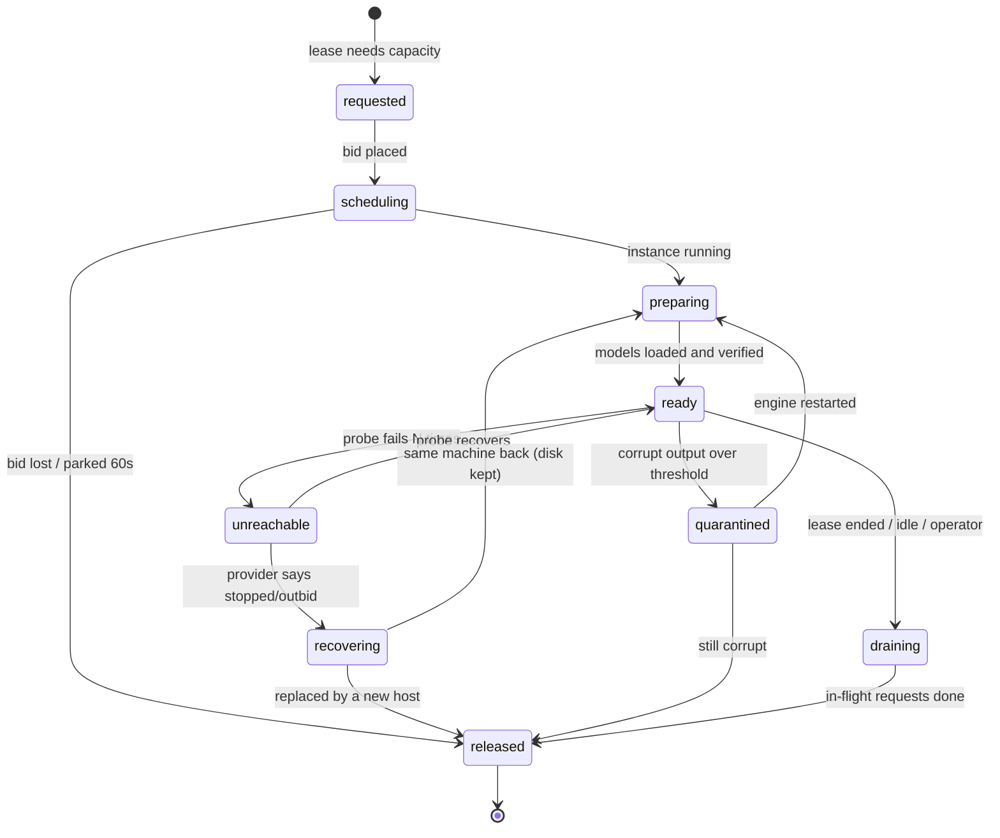

> **ARCHIVED — superseded 2026-09-17.** This is the single-file design as it stood before it was
> split into a generic core and an adopter guide. It is kept only so the section numbers cited in
> [../architecture-review.md](../architecture-review.md) still resolve, and for the framework
> comparison in §4.4. **Do not edit; do not build from it.** Current docs:
> [../overview.md](../overview.md).

# GPU Host Pool — Design

> Draft, written 2026-09-17. Area: dev. Tracked as GPU-POOL-01 in
> `platform-design/unified/TASKS.md`. Moved here from `platform-design/unified/_drafts/` on
> 2026-09-17 — this project keeps its docs in its own folder, outside the platform design set.
> Extends [gpu-cloud-migration-workplan.md](../adopters/aletheia/gpu-cloud-migration-workplan.md) (GPU-CLOUD-01);
> supersedes nothing yet. No code written, nothing provisioned.

A framework that keeps a pool of model-serving GPU hosts available to LLM clients, where a host
can be any of three kinds. **Intent (decided 2026-09-17): this is to be released publicly as a
reusable framework**, with Aletheia as its first adopter — see §0 for what that changes.

| Kind | Example | Who controls its lifetime | Billed |
|---|---|---|---|
| **local** | Ollama on this Mac (`127.0.0.1:11434`) | nobody — it is just there | no |
| **rented-interruptible** | Vast.ai bid instance | the pool: bid, recover, replace, destroy | per hour + storage + ingress |
| **fixed-remote** | an SSH-reachable box or an on-demand cloud instance at a known address | nobody by default; optional start/stop commands | flat or per hour |

## 0. Intent: a public framework, Aletheia as first adopter

Decided 2026-09-17. Until this point the design was written as internal tooling for one
developer on one Mac, and it shows. Publishing changes the bar in five ways:

| Area | Internal-tool assumption in this document | What a public framework needs |
|---|---|---|
| **Separation of generic and specific** | Aletheia names are woven through the design: `chat-agents`, `vast_provision.py`, the `aletheia-llm` label, `~/.aletheia/`, Langfuse, `gemma4` calibration constants, `nomic-embed-text-v2-moe` | A generic core that names none of them. Everything Aletheia-specific moves to an *adoption guide* and an example config. The §1 "what exists today" analysis stays as the motivating case study, not as part of the spec |
| **Extension points** | One provider (Vast), one engine (Ollama), built-in strategies | Three stable plug-in interfaces: **provider** (rent / bid / release — §3.2), **engine** (how to list models, probe health, count parallelism; Ollama first, OpenAI-compatible servers such as vLLM and llama.cpp next, passed through rather than translated), **strategy** (§7.6–7.9 are already pure functions). Third parties add a provider without forking |
| **Safety by default** | Trusts its operator; defaults tuned to one person's risk appetite | Strangers will run this with real money and real data. Nothing rents without an explicit lease; untrusted hosts are opt-in per client (review F5); no unauthenticated listener off loopback; no guessed model pulls (review F9); dollar caps are mandatory, not optional, on any lease that can rent |
| **Robustness** | "It is one process on my Mac; I will restart it" | Process isolation (§2.2), explicit lifecycle verbs, SQLite state, provider APIs rather than CLI scraping, a fake provider so the whole thing is testable without an account |
| **A contract others can depend on** | The HTTP surface and SDK can change whenever convenient | The app-facing contract (Ollama passthrough + the small pool dialect: client id, session id, machine-readable `503`) and the plug-in interfaces are **versioned**. The SDK and the control API follow semantic versioning |

Practical consequences outside the design itself:

- **Its own repository**, started clean rather than split out of this one — this repo's history
  contains Aletheia-internal material and local credentials that should not travel.
- **A neutral name** for the package, CLI, label prefix and state directory. `gpm` is a
  working title; nothing should be called `aletheia-*`.
- **A licence** chosen before the first public commit.
- **v1 must be small.** A public v1 that is narrow and dependable beats a wide one that is not;
  the cut line in the architecture review (F6) matters more now, not less.

**The scripts that use GPUs in this repo today are not design inputs** (decided 2026-09-17).
The framework is specified on its own terms — what any client, provider and engine need — and
not by what `chat-agents`, the labeling pipeline or `vast_provision.py` happen to do now. Where
this document still argues from them (§1, and scattered references to their timeouts, flags and
functions), read that as background on the first adopter, not as requirements.

The rest of this document has **not yet been rewritten** to this standard. Sections still speak
in Aletheia's terms; treat those as the first adopter's configuration, to be lifted out when
the document is split (review, "Document defects").

---

## 1. What exists today, and where it stops scaling

Everything below was read from current source, not assumed.

| Piece | Where | What it does | Limit |
|---|---|---|---|
| Provisioner | `prototypes/per-turn-behavioral-labeling/vast_provision.py` | Offer scoring (bandwidth per dollar, ingress-aware), bid = floor + premium, two-tier recovery (raise bid on same machine, else replace), verified destroy, following tunnel, per-card slot formula | Exactly **one** host, one provider, identified by a label |
| Concurrency gate | `chat-agents/agents/ollama_gate.py` | One global semaphore | A single number for "the" host; pushed in from outside by `sync_app_gate` |
| Host-loss handling | `chat-agents/agents/host_health.py` | Probe, transport-error classifier, poisoned-session span filter | Treats host loss as session-fatal, because there is nowhere else to send the turn |
| Driver pause/recover | `generate_sessions.py` (`wait_for_gpu_host`, `_run_recover_if_due`) | Workers block until the host is back; one worker shells out to `recover` under a file lock | Recovery is triggered by whichever *client* notices, not by an owner of the host |
| Endpoint config | `OLLAMA_URL` / `OLLAMA_BASE_URL` in `chat-agents/.env`; **hardcoded `localhost:11434`** in `langfuse_ollama.py`, `step3_match_and_assign.py`, `run_judge_eval.py`, `run_local_slm_poc.py` | One address per client | The labeling pipeline cannot reach a rented host at all without edits |

The hard-won knowledge in `vast_provision.py` (bid volatility, parked-instance billing,
`--cancel-unavail`, ingress cost, pinned image, team-key SSH workaround, prediction-based slot
ceiling) is correct and stays. What is missing is an **owner**: one process that knows every
host, its state, its capacity and its cost, and that every client talks through.

---

## 2. Design in one picture

```
  chat-agents app        labeling pipeline        judge eval / ad-hoc scripts
        \                       |                        /
         \______________________|_______________________/
                                |   plain Ollama HTTP API, one address
                                v
        +--------------------------------------------------+
        |  pool service  (router + supervisor — §2.2)      |
        |                                                  |
        |  request router  — 127.0.0.1:11435               |
        |    picks a ready host per request, per-host      |
        |    workers per host, retry on another host       |
        |                                                  |
        |  host supervisor — control loop                  |
        |    probe, state machine, tunnels, recover,       |
        |    leases, idle release, budget, orphan sweep    |
        |                                                  |
        |  host kinds:  local | rented-interruptible |     |
        |               fixed-remote                       |
        +-----------+----------------+---------------------+
                    |                |                 |
              127.0.0.1:11434   ssh tunnel :11441   ssh tunnel / direct URL
              Mac Ollama        Vast instance A     fixed box
```

### 2.1 The boundary between pool and app (requirement, 2026-09-17)

The pool is a **separate layer that serves GPU compute**; an app is something that **requests**
it. The contract between them is the Ollama HTTP API at one URL, and nothing else.

| The app knows | The app never knows |
|---|---|
| One base URL and **the pool's API key** (required — §2.3) | How many hosts exist, what kind they are, where they run |
| Standard HTTP semantics: `200`, `503` + `Retry-After`, a transport error | Bids, leases, tunnels, providers, recovery, cost |
| The model tag it wants | Which host holds that model, worker counts, VRAM |

Consequences, each of which removes a coupling that exists today:

- **No pool *server* code inside any app.** Apps depend on at most the thin **client SDK**
  (§4.1), which knows a URL and the HTTP contract and nothing about hosts, providers or bids.
  The supervisor, router and host kinds are never imported by `chat-agents/` or `prototypes/`.
  Pointing an app at a bare engine, at a pool on the same machine, or at a pool elsewhere is a
  configuration change, not a code change. Any plain Ollama client still works against the
  router — it just does not get the default waiting behaviour. *It is not true that an app
  "cannot tell the difference":* the pool adds a small, named dialect on top of the engine's
  API, set out in §2.4.
- **The pool never calls into the app.** Today `vast_provision.sync_app_gate` POSTs the worker
  count into chat-agents' `/api/config` — the infrastructure reaching into its consumer. That
  goes away. The router enforces per-host limits and queues the excess, so an app that sends too
  much simply waits. `ollama_gate.py` becomes an ordinary client-side setting the app owns.
  (`generate_sessions.py --workers auto` may *read* `/pool/status` to size itself — an optional
  optimisation in a driver script, not a dependency of the app.)
- **Apps do not trigger recovery, they wait for it.** `generate_sessions.py`'s
  `_run_recover_if_due` (a client shelling out to the provisioner) is retired. Recovery is the
  supervisor's job; the client's job is to retry while the pool has nothing to give, and the
  SDK does that **by default** (§4.1) so no app has to write the loop.
- **Leases are opened by an operator or a run script, not by the app.** `gpm lease open` is a
  CLI/HTTP call made alongside a run. The app serving requests is unaware a lease exists.
- **What stays in the app is app business:** `host_health.py`'s poisoned-session filter is about
  keeping half-finished sessions out of *its* Langfuse. It reacts to a generic transport error
  and needs no knowledge of the pool.
- **The pool's location is free.** It defaults to the Mac because the apps are there, but it is
  a network service: the same process can run on a small always-on box and be reached over
  HTTPS with a key.

### 2.2 Process layout (decided 2026-09-17)

The pool is **two processes**, not one, because its two halves have opposite needs:

| | Router | Supervisor |
|---|---|---|
| Job | Sits in the path of every model call | Rents, bids, tunnels, probes, recovers, tears down |
| Must | Never stall — its latency is the app's latency | Do slow, blocking, failure-prone work: provider calls, SSH, waiting minutes on an auction |
| Depends on | A **host table** it reads | Providers, the network, the market |
| If it dies | Apps get transport errors; the SDK retries | **Routing continues** on the last published host table — local and fixed hosts are unaffected, rented hosts keep serving until they actually fail |

They share one SQLite database (WAL mode): the supervisor publishes the host table, leases and
decisions; the router reads the table and writes the request log and per-host counters (which
is how the supervisor learns about corruption and idleness). Neither calls the other directly.
The control API and console are served by the supervisor process; the app-facing Ollama
endpoint by the router process. One command (`gpm serve`) starts both; they can be restarted
independently.

This guarantees by construction what a single process could only promise by discipline — that
no provider call, however slow or hung, can pause an app's request — and it lets the supervisor
be restarted for a config or code change **without dropping a single in-flight request**.

**Stopping is explicit; exiting destroys nothing.** "The pool exited" used to mean three
different things handled one way. Now:

| What happened | Command | Rented hosts |
|---|---|---|
| Operator is finished | `gpm stop --release` | Drained, destroyed, verified |
| Restart for a config or code change | `gpm restart` / `gpm stop` | **Kept.** Re-adopted on start from the provider listing (§7.4) |
| Crash, power loss, laptop asleep | — nothing runs | Covered by the on-host dead-man timer and lease expiry (§7.9), then the orphan sweep on next start |

There is no implicit release-on-exit. It cannot be made reliable (a crash runs no exit code) and
when it does run it is usually wrong (a restart would destroy a host holding tens of GB of
loaded models).

### 2.3 A pool is the unit of isolation, and it has a key (decided 2026-09-17)

Requests are not individually identified, and the pool does not try to tell its clients apart.
Instead the **pool itself** is the boundary: one pool has one set of hosts, one routing policy,
one set of leases and one budget, and **an app may use it only by presenting that pool's API
key**. Anything that needs to be kept apart — separate budgets, interactive traffic away from a
batch backlog, data that must stay on trusted hosts — is kept apart by being a **different
pool**, not by labelling requests inside one. (Resolves architecture-review finding F4.)

| Question | Answer under this model |
|---|---|
| Whose budget does a rented host burn? | The pool's. Want separate budgets → separate pools |
| Whose lease authorises renting? | The pool's. Holding the key *is* the authorisation to use that pool's capacity, rented capacity included. `503 no_lease` is unambiguous |
| Where do per-client policies live (runtime-class defaults, which hosts data may reach)? | On the pool. A pool for sensitive data simply does not contain untrusted hosts |
| Who is served first inside a pool? | First come, first served. No classes, no per-client fairness — by decision, for now |

**The key.**

- **Always required**, loopback included — sent as `Authorization: Bearer <key>`, which plain
  Ollama clients, LangChain (`client_kwargs={"headers": …}`) and the SDK (`GPM_API_KEY`)
  can all do. A missing or wrong key is `401`, which the SDK raises as `PoolAuthError` and
  **never retries**. Requiring it on loopback also closes the hole where any web page open in
  the operator's browser can send requests to `127.0.0.1`.
- **Two kinds, never interchangeable.** The **app key** permits inference and `/pool/status`,
  nothing else. The **admin key** is required for the control API and the console — leases,
  configuration, releasing hosts. An app that can ask for a completion must not thereby be able
  to spend money.
- Stored hashed; created and rotated with `gpm key create | rotate | revoke`; two app keys may
  be valid at once so rotation needs no downtime. Off loopback, a key is only accepted over TLS
  (§7.5) — a bearer key on plain HTTP is a published key.

**Multi-pool management is future work**, not part of v1. It is where fairness between
workloads, per-team budgets and an overview across pools will live. One question it must answer
and this design does not: **can two pools share a physical host?** If yes, something above the
pools has to split that host's workers between them (the Mac: one worker to pool A, two to
pool B); if no, a host belongs to exactly one pool. Recorded in §13.

A natural later extension, deliberately not taken now: several app keys per pool would give
per-client identity in the request log for free — the key id *is* the client — without adding
anything to the app-facing contract.

### 2.4 The app-facing contract, stated honestly (decided 2026-09-17)

The contract is **the engine's own HTTP API, plus a small pool dialect**. Each item of the
dialect is versioned with the contract; nothing else is added silently.

| Dialect item | Required? | What it does |
|---|---|---|
| Pool API key (`Authorization: Bearer`) | **Required** | Admits the app to this pool (§2.3) |
| Logical model names | Opt-in per model, by the operator | A name **listed in the catalog** resolves to the right build for the host that serves it (§4.2). The same request can therefore return a different build through the pool than against a bare engine — by design, and only for names the operator catalogued |
| Model actually served | Always reported | In the response body's own `model` field and the `X-GPM-Served-Model` header, with `X-GPM-Host` and `X-GPM-Runtime-Class` |
| Machine-readable `503` | Always | `reason` and `retry_after_s` in the body, `Retry-After` in the header (§4.1). A client that ignores the body still behaves correctly |
| Session id (`X-GPM-Session`) | Optional | Groups calls in the request log; drives routing only if an affinity or build-consistency switch is on |
| Deadline (`X-GPM-Deadline`) | Optional | Lets the router drop work that can no longer be used (§4.3) |

Everything outside this table is passed through to the engine untouched.

Three decisions carry the design:

1. **Clients see one Ollama endpoint.** The router speaks the Ollama HTTP API and listens on
   `127.0.0.1:11435` — the port `chat-agents/.env` already points at. chat-agents needs no
   change; the prototype scripts need their hardcoded address turned into an env var and nothing
   else. No client learns that a pool exists.
2. **Desired state, reconciled.** A config file declares hosts and policy; a loop compares it to
   what the providers report and acts on the difference. Recovery stops being something a client
   shells out to and becomes the supervisor's job.
3. **Spending needs a lease.** The pool never rents anything on its own initiative. A person (or
   a run driver invoked by a person) opens a lease with a dollar cap and a duration; within that
   lease the pool may bid, recover and replace unattended. No lease, or lease exhausted → rented
   hosts are released. This is the existing `--yes` rule, made durable.

---

## 3. Host model

### 3.1 Host record

One record per host, persisted in the pool state file.

| Field | Meaning |
|---|---|
| `host_id` | Stable name: `mac`, `vast-1`, `lab-box` |
| `kind` | `local` / `rented-interruptible` / `fixed-remote` |
| `provider_ref` | Provider's own identifiers (Vast instance id, machine id, offer id) |
| `transport` / `endpoint` | How the host is reached — `tunnel`, `http` or `https` (§7.5) — and the resulting URL plus auth headers the router dials. For `tunnel` that URL is the local end of a supervised SSH forward |
| `platform` | `mac` / `other` / `unknown`, plus how it was learned (declared, implied, ssh, probed) — §4.2 |
| `variants` | Per logical model: which build this host serves (`mlx` or `standard`), whether it enforces `format` schemas, when that was established — §4.2 |
| `runtime_class` | Output-equivalence class: `apple-mlx`, `apple-gguf`, `cuda-gguf`. Derived per (host, variant served), not typed in — §6 |
| `models_present` / `models_loaded` | From `/api/tags` and `/api/ps`, refreshed by the probe |
| `priority` | Routing tier, lower number = used first. Defaults by kind: `local` 0, `fixed-remote` 10, `rented-interruptible` 20; overridable per host (§4) |
| `workers` | The host's workers — each serves one request at a time; count set by capacity (§5) |
| `state` | §3.3 |
| `cost` | Hourly all-in rate, accumulated spend, lease it is charged to |
| `measured` | Rolling tokens/s, latency, failure and corruption counts |

### 3.2 Host-kind interface

Each kind implements the same small interface; the supervisor never branches on kind.

| Operation | local | rented-interruptible (Vast) | fixed-remote |
|---|---|---|---|
| `discover()` — what exists right now | the configured URL | `show instances` filtered by label | the configured address |
| `acquire(spec)` | no-op | search → reject → score → bid → wait-running, bail if parked | optional `start_cmd`, else no-op |
| `connect(host)` | none | per the host's transport (§7.5): supervised tunnel by default, or `http`/`https` to the provider-mapped port | per the host's transport: tunnel, `http` or `https` |
| `prepare(host)` | verify models present | onstart pull; wait for `.models_ready`; preload; verify **all** co-resident models in `/api/ps` | pull if missing; preload |
| `recover(host)` | none (report only) | tier 1 raise bid on same machine; tier 2 replace, excluding that machine | reconnect; optional `restart_cmd` |
| `release(host)` | no-op | destroy **and verify by re-listing** | optional `stop_cmd` |
| `hourly_cost(host)` | 0 | bid + storage, plus ingress amortised for new hosts | configured flat rate |
| `reported_charges(host)` | 0 | what the provider says this instance has cost so far — the figure caps are reconciled against (§7.3) | configured flat rate × time |

`vast_provision.py` maps onto the middle column almost function-for-function (`search_offers`,
`offer_rejections`, `score`, `create_instance`, `raise_bid`, `destroy_all`, `wait_running`,
`tunnel_cmd`). The move is a relocation, not a rewrite. The single-label assumption
(`our_instances()` returns "the" instance) becomes a label per host: `aletheia-llm/<host_id>`.

A future provider (RunPod, AWS spot) or a future engine (vLLM) is a new column, not a new design.

**Providers are driven through their HTTP API, not their command-line tool** (decided
2026-09-17). Scraping a CLI is how this started and is the wrong base for an unattended service
that spends money: output formats change between versions, interactive prompts need
workarounds, errors arrive as text rather than status codes, and it drags in a separate runtime
to install. The provider plug-in is an API client with typed errors, timeouts and retries; the
CLI remains a developer's debugging aid and nothing in the pool depends on it being installed.

### 3.3 Host states



`local` and `fixed-remote` hosts only ever move among `ready`, `unreachable`, `quarantined` and
`disabled`. Only `ready` hosts receive requests.

Two states are new relative to today:

- **quarantined** generalises `restart_ollama_server` and the corruption markers in
  `langfuse_ollama.is_corrupt`. Today a corrupting server is restarted by whichever script
  notices. In the pool, the router counts corrupt responses per host, stops routing to a host
  that crosses the threshold, and the supervisor restarts its engine (and replaces the host if
  that does not clear it).
- **draining** lets a host finish in-flight turns before release, so ending a lease never
  produces a poisoned session.

---

## 4. Request router

A thin reverse proxy for the Ollama API. It reads the request's `model` field (to route, and to
resolve the variant — §4.2) and never parses or rewrites model output.

**Routes passed through:** `/api/chat`, `/api/generate`, `/api/embed`, `/api/embeddings`,
`/api/show`. **Answered by the pool:** `/api/tags` (union of models on ready hosts, listed under their logical names — §4.2), `/api/ps`
(merged), plus `/pool/status`, `/pool/leases`, `/pool/events`.

**Routing priority (requirement, 2026-09-17).** Hosts are used in strict tier order, and a lower
tier is touched only when every eligible host above it is full:

| Tier | Kind | Why it sits there |
|---|---|---|
| 0 — first | `local` | Free and treated as always up. Its workers are filled before anything else is considered |
| 10 | `fixed-remote` | Steady capacity that exists whether or not we use it |
| 20 — last | `rented-interruptible` | Brought up and down on demand, and may vanish mid-run. Routed to last, so they carry only the overflow |

The tier is the host's `priority` field: the numbers above are defaults per kind and any host
can override them (a slow fixed box can be pushed below a fast one). "Always up" is a routing
assumption for `local`, not a blind one — it is still probed, and an unreachable local engine is
skipped like any other host rather than fed requests.

**Choosing a host, per request:**

1. **Eligible** = state `ready` — which implies the pool's whole model set is loaded (§5.5) —
   a usable variant of the requested model for this request (§4.2), runtime class acceptable to
   the request (§6). A model outside the pool's set is refused, never loaded on demand.
   Priority only ever orders eligible hosts; it never makes an ineligible one usable.
2. Take the **highest-priority tier that has an idle worker** among eligible hosts.
3. **Within that tier**: the host with the lowest `busy / total` workers, ties broken by measured tokens/s.
   **Session affinity is off by default** (decided 2026-09-17): every turn is routed on its own
   merits. It can be switched on (`session_affinity: within_tier | across_tiers`) if measurement
   later shows that re-processing long prompts on a new host costs more than the routing
   freedom is worth — Ollama reuses a cached prompt prefix only on the host that built it.
4. Every eligible tier is full → queue, **first come, first served** (decided 2026-09-17: no
   request classes, no separate lane for short calls such as embeddings — they wait their turn
   like everything else), bounded by `queue_timeout`; a queued request takes the
   first worker to free up, highest tier first. No eligible `ready` host at all → `503` with a
   reason (§4.1).
5. A retry after a pre-first-byte host failure goes to the next eligible host in the same
   order — once, never for "no capacity" (§4.3).

Two properties fall out of routing to rented hosts last:

- **Rented hosts go idle first**, so the idle-release rule (§7.3) fires on exactly the hosts
  that cost money, as soon as the higher tiers can carry the load alone.
- **The decision to rent is the overflow**: demand that tiers 0 and 10 cannot absorb. The
  supervisor sizes rented capacity from that difference (§7.2), and scales down in reverse
  priority order — interruptible hosts drain first, fixed hosts are never released by load.

One cost to be aware of: strict priority means the slowest engine (the Mac) is always busy. It
adds throughput — its workers are extra capacity — but the turns it serves are slower than the same
turn on a rented card, so per-session latency becomes uneven. The serving host is recorded per
call, so this is visible rather than hidden.

**Failure handling:**

- A transport error **before the first response byte** → retry **once**, on the next eligible
  host in priority order (§4.3 rule 2). Every
  `/api/chat` call carries the full message history, so a conversation can move hosts between
  turns with no state to transfer. This is the main functional gain: an eviction during a
  12-turn session stops being session-fatal whenever a second host exists.
- A transport error **mid-stream** → surface it unchanged. `host_health.is_connection_error`
  and the poisoned-session filter keep working exactly as they do now, as the last line of
  defence rather than the first.
- Every request is appended to a request log: time, client session id, host, **model requested,
  model served, runtime class**, latency, token counts. The served model also comes back in the
  response body (Ollama's own `model` field, untouched — and LangChain keeps it in
  `response_metadata["model"]`); the serving host and runtime class come back as response
  headers. **What actually served a call is a fact worth keeping** — it is the only way to later
  separate a behavioural difference from a build or hardware difference. See §6.1 for how that
  record is made usable.

### 4.1 Client SDK (requirement, 2026-09-17)

Every app reaches the pool through one small Python package, and **waiting for capacity is its
default behaviour**: when the pool has no resource available, the call blocks and retries
instead of failing. An app gets this by constructing the client; it opts *out*, not in.

**Why a transport, not a wrapper.** The apps do not share a calling style: chat-agents goes
through LangChain (`ChatOllama`, `OllamaEmbeddings`), the labeling pipeline uses raw `urllib`.
A wrapper function would cover one of them. So the SDK's core is an **httpx transport** that
retries underneath whatever client sits on top. Verified against the installed versions:
`langchain-ollama` 1.1.0 forwards `client_kwargs` into `httpx.Client(**kwargs)` (via `ollama`
0.6.2), so a custom `transport=` is accepted with no call-site changes.

```python
from gpm_client import PoolClient, pool_transport, async_pool_transport

# LangChain apps: one added argument in chat-agents' _chat_ollama(); every call site unchanged
ChatOllama(model=model, base_url=OLLAMA_BASE_URL,
           sync_client_kwargs={"transport": pool_transport()},
           async_client_kwargs={"transport": async_pool_transport()})

# Scripts: replaces raw_call_ollama's urllib block and the hardcoded localhost:11434
pool = PoolClient()                      # GPM_URL / GPM_API_KEY from env
text = pool.chat(model, messages, format=schema, session_id=sid).content
vecs = pool.embed("nomic-embed-text-v2-moe", texts)
```

**Default retry policy** (`RetryPolicy()`, every field overridable per client, per call, or by
env var):

| Situation | Default |
|---|---|
| `503` from the router (no ready host, queue timed out, model still loading) | **Retry.** Wait `Retry-After` if given, else exponential backoff 2 s → 60 s with jitter |
| Transport error before any response byte (router restarting, connection refused) | **Retry**, same backoff |
| Failure **mid-stream**, after tokens were delivered | **Not retried** — raise `PoolStreamInterrupted`. The app has already consumed partial output; only it can decide to redo the turn |
| `401` — missing or wrong pool API key | Not retried — raise `PoolAuthError` |
| Other `4xx`, model unknown to every host | Not retried — raise `PoolRequestError` |
| `503` whose reason says waiting cannot help (`no_lease`: only rented hosts could serve this and no lease is open) | **Fail fast** with `PoolUnavailable`; set `wait_without_lease=True` to wait anyway |
| Total time allowed waiting | `max_wait`, **configurable** — ships at 30 min, then `PoolUnavailable`. Set by, in order of precedence: per call (`pool.chat(..., max_wait=...)`), per client (`RetryPolicy(max_wait=...)`), env `GPM_MAX_WAIT_S`. `None` / `0` / `forever` = wait indefinitely (what batch drivers want; replaces `--host-wait-timeout 0`) |
| Visibility while waiting | Logs one line per minute with the reason; optional `on_wait(reason, waited_s, next_try_s)` callback |

For this to work the router's `503` is machine-readable — the one addition to the otherwise
plain Ollama contract:

```json
{"error": "no_capacity", "reason": "recovering", "retry_after_s": 30,
 "detail": "vast-1 outbid; re-bidding on same machine"}
```

Reasons: `queue_timeout` (hosts busy), `recovering` (supervisor is bringing a host back),
`preparing` (host up, models loading), `hosts_unreachable` (configured hosts not answering),
`no_lease`. A client that ignores the body and just honours `Retry-After` still behaves
correctly, so non-SDK clients are not broken by it.

**Two layers of waiting, on purpose.** Short waits (all workers busy) are absorbed by the
router's queue and the app sees only a slower response. Long waits (no host at all, an
eviction being recovered) are the SDK's retry loop. Neither is app code, and §4.3 fixes how
the two relate so they never duplicate or strand a request.

**What else the SDK carries** — deliberately little:

- **Typed errors**: `PoolUnavailable`, `PoolStreamInterrupted`, `PoolRequestError`. These
  replace the string-marker sniffing in `host_health.is_connection_error`; the app poisons a
  session on the first two and nothing else.
- **Session id** (optional): `session_id=` sets the `X-GPM-Session` header. It is written to
  the router's request log so calls can be grouped per session; it only influences routing if
  the pool has `session_affinity` switched on, which it is not by default.
- **Served variant as a recorded fact**: `response.served_model` — the app asked for
  `gemma4:e4b`, and this says whether `gemma4:e4b-mlx` or `gemma4:e4b` actually answered (§4.2).
- **Wait time as a recorded fact**: each response exposes `pool_wait_s` and the serving host
  (from the router's response headers). A turn that waited 40 minutes for a re-bid must not
  look like a 40-minute generation; the app can put both in trace metadata so latency analysis
  stays honest.
- `pool.wait_until_ready(models=[...])` for a driver's pre-flight, replacing
  `host_health.host_healthy` and `generate_sessions.wait_for_gpu_host`.
- Sync and async variants of everything; dependencies: `httpx` only.

**What it never contains:** host lists, provider names, bids, lease management, tunnels. Lease
commands live in the operator CLI, not the SDK — an app that could open leases could spend
money, which is exactly the coupling §2.1 rules out.

Retrying is safe because an `/api/chat` call has no server-side effect to duplicate: the full
history travels with each request, and tools are executed by the app, not by Ollama.

### 4.2 Model variant resolution (requirement, 2026-09-17)

An app asks for a model by its **logical name** — `gemma4:e4b` — and the pool decides which
build of it each host should run: the MLX build on a Mac, the regular build everywhere else. The
app never writes `-mlx` and never needs to know what the target machine is.

**Catalog — the only source of substitutions (decided 2026-09-17).** A logical name maps to
variants, and **only names listed here are ever resolved**. A model that is not in the catalog
is passed through exactly as requested: no substitution, no guessed `<name>-mlx`, no pull. A
naming convention that downloads artifacts by a guessed name is a supply-chain risk (a guessed
name is a name someone else can register), a silent substitution the operator never wrote down,
and an unrequested multi-GB download. One catalog line per model is the whole cost of avoiding
all three.

```yaml
models:
  gemma4:e4b:           { mlx: gemma4:e4b-mlx,  standard: gemma4:e4b }
  gemma4:31b:           { mlx: gemma4:31b-mlx,  standard: gemma4:31b }
  qwen2.5:7b-instruct:  { standard: qwen2.5:7b-instruct }        # no MLX build
  # unlisted models: passed through literally — never guessed, never substituted
```

**Per request:** the router picks a host (§4), looks up the variant recorded for that
(host, logical model), rewrites the request's `model` field, and forwards. The response body is
left untouched — it names the tag that really ran, which is a fact worth keeping — and the
router adds `X-GPM-Served-Model`. Rules:

- **Prefer MLX where it is known to work**, otherwise the standard build.
- **An explicit tag is taken literally.** Asking for `gemma4:e4b-mlx` means exactly that and is
  only eligible on hosts that have it. `resolve_variants=False` on the client does the same for
  the plain name (force the standard build even on a Mac).
- **A request carrying a `format` JSON schema never resolves to a variant that does not enforce
  it.** Ollama's MLX engine ignores `format` — that is why the labeling pipeline keeps steps 1–2
  off MLX and parses step 3 leniently. Silently upgrading such a call to MLX would turn
  guaranteed-valid JSON into best-effort JSON. For those requests the host's standard build is
  used if present; if not, the host is ineligible and the request goes down the priority order.
  Whether a variant enforces schemas is *measured* by the probe below, not assumed from its
  name, so this rule corrects itself if Ollama's MLX engine gains schema support.

**Learning what a host is.** Each host carries `platform: mac | other | unknown`. It is settled
by the cheapest available evidence, in this order, and the source is recorded:

| # | Evidence | Applies to | Cost |
|---|---|---|---|
| 1 | Declared in config | any host | none |
| 2 | Implied by how we created it — a rented instance from our CUDA image is `other` | `rented-interruptible` | none. **These are never probed**: an `-mlx` pull on a Vast host is a multi-GB download billed per GB to learn something already known |
| 3 | `uname` over the existing SSH connection | `tunnel` hosts | one command |
| 4 | **Behavioural probe** | hosts reached only by `http`/`https`, still `unknown` | one small generation |

The behavioural probe is the try-it-and-remember path, run per (host, logical model) the first
time that pair is needed:

1. (Catalogued models only.) Is the catalog's MLX variant on the host (`/api/tags`)? If not, pull it only when the host allows it
   (`allow_probe_pull`: on for `local` and `fixed-remote`, off for rented). Absent and not
   pullable → standard.
2. Run a short fixed generation on the MLX variant. It **works** if it loads, answers within the
   timeout, and the output is free of the corruption markers the repo already tracks
   (`<unused`, `<pad>`, repetition collapse).
3. Run one schema-constrained call and record whether the schema was actually enforced.
4. **Works →** record `variant = mlx` for that pair and mark the host `platform: mac`
   (source: probed). **Fails →** record `variant = standard`, mark the host `other`, and do not
   try MLX on it again.

Results live in the pool state file, so the next session starts already knowing. They are
re-examined only when something could have changed them: the host's Ollama version changes, a
fixed host's identity changes, or an operator runs `gpm host reprobe <host>`. One `unknown`
host never blocks a request — it is served with the standard build while the probe runs.

**Demotion.** A pair marked `mlx` that later starts failing or corrupting is dropped to
`standard` for that model on that host by the same counters that drive quarantine (§3.3), with
an event logged. Marking is per (host, model), so one bad MLX build does not take a Mac's other
MLX models with it.

**Knock-on effects elsewhere in the design:**

- `prepare(host)` pulls, per host, the variant that host will actually serve — a lease listing
  `gemma4:e4b` causes `gemma4:e4b-mlx` to be pulled on the Mac and `gemma4:e4b` on a rented card.
- Runtime class (§6) stops being a label typed into config and becomes a **consequence of the
  variant served**: the same Mac is `apple-mlx` for `gemma4:e4b` and `apple-gguf` for
  `qwen2.5:7b-instruct`. A runtime-class pin therefore also constrains variant choice — pin
  `apple-gguf` and the Mac serves the standard build.
- Worker calibration (§5.1) is keyed by the variant actually loaded, not the logical name.

### 4.3 Time budget: who waits, who retries, who cancels (decided 2026-09-17)

Several layers can wait on a request — the client's HTTP library, the SDK, the router's queue,
the router's cross-host retry. Left unrelated, they produce abandoned work: a client gives up
while its request is still queued and retries, the request now exists twice, and a worker
eventually runs a generation nobody is listening to. Under load that feeds itself (timeouts →
retries → longer queue → more timeouts), and on rented hosts the wasted work is paid for. Since
the pool cannot know an arbitrary client's timeout, the contract states the budget.

**Five rules:**

1. **Cancel on disconnect.** When the client goes away, the router cancels the upstream request
   and frees the worker immediately — whether the request was queued or already generating.
2. **One layer retries for capacity: the client side.** The SDK's retry loop (§4.1) is the only
   capacity retry. The router's cross-host retry exists for one case — the chosen host failed
   before the first response byte — and is attempted **once**, on the next eligible host in
   priority order. It never loops, and it never retries "no capacity".
3. **The SDK owns client timeouts**, split three ways, and callers do not set raw ones:

   | Timeout | Covers | Default |
   |---|---|---|
   | connect | reaching the router | 5 s |
   | time to first byte | queueing **plus** model load **plus** prompt processing | 300 s |
   | between bytes | a stalled stream | 60 s |

   **Invariant:** `router queue timeout < SDK time-to-first-byte`. The router always answers a
   queued request (with a worker or a `503`) before the SDK would give up on it, so an SDK
   client never abandons a request the router still holds. Config validation rejects values
   that break this.
4. **Clients without the SDK get an early, clean answer.** The router's queue timeout defaults
   to 30 s — shorter than common HTTP client defaults — after which it returns
   `503 queue_timeout` with `Retry-After` rather than leaving a socket hanging. The limits in
   force are published in `/pool/status`, so any client can configure itself against them.
5. **Deadlines travel with the request.** A client may send `X-GPM-Deadline` (the SDK does, from
   its own budget). The router drops a queued request whose deadline has passed, and does not
   start one that cannot finish its first byte in time — no worker begins work that is already
   too late to be used.

Non-streaming requests follow the same rules with one difference in feel: "first byte" is the
whole response, so the time-to-first-byte budget must cover the full generation. The SDK sets
it from `num_predict` when the caller provides one, and otherwise uses the longer default.

### 4.4 Build or adopt

Checked 2026-09-17 against each project's own docs. No framework covers the
whole requirement; the split is clean — some route, some provision, none do both, and **none
offers programmable bidding**.

| Requirement | Olla | LiteLLM proxy | SkyPilot / SkyServe | dstack |
|---|---|---|---|---|
| App sees one endpoint, unaware of hosts | yes | yes | yes | yes (gateway) |
| Native Ollama API kept (`format` schema, tools) | Ollama-aware, under a `/olla/ollama/` prefix; byte-for-byte `/api/chat` passthrough **not confirmed** in docs | **no** — clients must speak OpenAI `/v1/chat/completions`; translated to Ollama | n/a (plain HTTP LB to replicas) | n/a |
| Backends over `http` / `https` URL | yes | yes | replicas it launched only | replicas it launched only |
| Backends over SSH tunnel | not itself — point it at a tunnel's local port | same | no | no |
| Mix local + fixed + rented hosts in one pool | yes, as static URLs | yes, as static URLs | **no** — cloud replicas only; controller must be a cloud VM | no |
| Add/remove hosts at runtime (evicted host replaced) | **no** — static YAML, no documented reload or API | believed yes (model-management API; not re-checked) | yes, its own replicas | yes, its own replicas |
| Per-host concurrency limit | not documented | rpm/tpm limits, not worker counts | not documented | — |
| Health checks, failover, retry on another host | yes | yes | yes | yes |
| Session affinity (KV-cache reuse) | yes | not checked | no (least-load only) | not checked |
| Provisions Vast.ai | no | no | yes | yes, **on-demand only** — no interruptible |
| Interruptible/bid instances on Vast | — | — | yes (`use_spot`) | **no** |
| **Customizable bidding** (floor + premium, ceiling, raise-bid-on-same-machine to keep the disk, ingress-aware ranking, bandwidth class filter) | — | — | **no** — a static `bid_price` passed through `create_instance_kwargs`; recovery means relaunch elsewhere | — |
| Leases / dollar caps / idle release / orphan sweep | no | spend tracking per key, no infra control | autoscale-to-zero, autostop; no dollar caps | idle duration; no dollar caps |

Reading of the table:

- **The provisioning half must be ours.** The bidding policy in `vast_provision.py` — and
  especially tier-1 recovery, which keeps the disk by re-bidding on the *same machine* — has no
  equivalent anywhere. SkyPilot's model is "preempted → launch a fresh replica", which on Vast
  means re-downloading ~34 GB at per-GB ingress cost every time. That is exactly the expense
  the current policy was written to avoid.
- **The routing half could be adopted, with one blocker each.** Olla is the closest fit
  (Ollama-aware, affinity, health, failover) but has no documented way to change its endpoint
  list at runtime, and hosts in this pool come and go. The workable pattern would be: the
  supervisor gives every host a *stable local port* (tunnel or a tiny forwarder) and Olla's
  static list names those ports — then a dead host is just an unhealthy endpoint. Costs: a
  second process, no per-host worker limit, a URL prefix the apps would have to carry (a small
  breach of "the app shouldn't care"), and unverified `/api/chat` fidelity. LiteLLM is out
  unless the apps move to the OpenAI API, which is the tool-calling risk the workplan already
  declined for vLLM.
- **Recommendation: write the router (~300 lines, FastAPI + httpx), own the supervisor.** The
  router is the smaller half, and owning it buys per-host workers, exact Ollama
  passthrough, the serving-host log, and hosts that appear and disappear at runtime. Revisit
  Olla if it gains dynamic endpoints.

Sources: [SkyPilot on Vast](https://vast.ai/article/vast-ai-gpus-can-now-be-rentend-through-skypilot),
[SkyServe](https://docs.skypilot.ai/en/latest/serving/sky-serve.html),
[SkyServe spot policy](https://docs.skypilot.co/en/stable/serving/spot-policy.html),
[dstack backends](https://dstack.ai/docs/concepts/backends/),
[Olla](https://github.com/thushan/olla), [Olla configuration](https://thushan.github.io/olla/configuration/overview/),
[LiteLLM Ollama provider](https://docs.litellm.ai/docs/providers/ollama).

---

## 5. Capacity: workers per host

The pool's unit of capacity is the **worker**. A worker belongs to one host and serves one
request at a time; a host holds as many workers as its hardware can usefully run, and the
pool's capacity is simply the workers on its `ready` hosts.

| Host | Workers | Where the number comes from |
|---|---|---|
| Mac, M4 Pro | up to **3** | capacity profile |
| RTX 6000D, ~80 GB | up to **6** | capacity profile — and it is the same 6 the measurements gave: memory ceiling 9 at 32K context, operated at two-thirds, because 6 → 9 added no throughput and ~1.8× latency |
| an unprofiled CUDA card | derived | the memory formula below |

*(Naming: a pool **worker** is serving capacity on a GPU host. It is unrelated to the
`--workers` processes of `generate_sessions.py`, which are client-side concurrency. Ollama's
own per-model "parallel slots" are the engine mechanism a worker maps onto.)*

### 5.1 How a host's worker count is set

"Up to" is the operative word: the profile gives a ceiling for the hardware, and what actually
runs is the smallest of three numbers.

```
workers(host) = min( profile max            — what this hardware class can usefully run
                   , memory ceiling         — what fits, for the models and context in use
                   , configured override )  — an operator's explicit lower number, if any
```

1. **Capacity profile** — a small table matched on what the host reports (platform/chip, or GPU
   name and VRAM). First match wins; a host can name a profile outright.
2. **Memory ceiling** — the measured rule carried over from `vast_provision.py`:
   `(VRAM GiB × 0.98 − fixed) / (per-worker GiB × ctx/32K)`. Ollama reserves worst-case KV cache
   for every parallel slot at full context and evicts a model on that *prediction*, so the
   ceiling depends on the model set and context, not just the card: an 80 GB card is 6 workers
   for `gemma4:26b` + `gemma4:e4b` at 32K, and would be fewer with a 31B model co-resident or
   more at 16K. The constants are calibration entries per model set (keyed by the variant
   actually loaded, §4.2), because they are only valid for the set they were measured on.
3. **Unprofiled hosts** fall back to the formula × the two-thirds operating point. With no
   profile *and* no calibration for the model set, the host gets **1 worker** and the console
   flags it — the pool does not guess upward.

Worker count is re-evaluated when the model set changes (a new lease, a variant demotion), not
per request.

### 5.2 Keeping the engine in step

A worker is only real if the engine behind it can run that many requests at once.

- **Hosts the pool creates** (rented): `OLLAMA_NUM_PARALLEL` is set to the worker count at
  creation, with context length pinned, exactly as `instance_env()` does today.
- **Hosts the pool does not create** (local, fixed-remote): the pool cannot set the engine's
  parallelism, and Ollama does not report it. If the Mac's Ollama is left at its default while
  the pool runs 3 workers, the extra requests silently queue inside Ollama and every latency
  number lies. So **test connection** (§9.2) includes a concurrency check — fire *n* short
  generations at once and compare wall time with a single one; near *n*× means the engine is
  serialising — and tells the operator what to set (`OLLAMA_NUM_PARALLEL=3` for the Mac).
- **Evidence over configuration.** If a `ready` host is seen dropping a model that should be
  resident (`/api/ps`), or its per-request latency climbs with concurrency while throughput
  stays flat, the supervisor steps that host's workers down by one and logs why. It never
  steps *up* past the profile on its own; raising a ceiling is an operator decision, backed by
  a calibration run (phase 4) that measures throughput at 1…n workers and proposes the knee.

### 5.3 Workers as things, not a counter

Each worker is a first-class object — `mac/w1`, `vast-1/w4` — with a state (`idle`, `busy`,
`draining`, `disabled`), the request it is serving, and its own counters (served, failed,
tokens/s). That buys three things a bare semaphore does not:

- **Dispatch is a pull.** A request goes to an idle worker on the highest-priority eligible
  tier (§4); if none is idle it queues, and the next worker to free up takes the oldest request
  it is eligible for — higher-tier workers first. Routing priority and queueing become one
  mechanism.
- **Graceful resizing.** Taking a host from 6 workers to 4 marks two as `draining`; they finish
  their turn and stop. No request is cut off to shrink a host.
- **Visibility.** The console shows every worker and what it is doing, so "the Mac is always
  busy and the rented card is half idle" is something you can see.

### 5.4 Around the pool

- **`ollama_gate.py` stays** as a client-side cap that chat-agents owns. The pool does **not**
  set it (§2.1) — `sync_app_gate` is retired. A gate above pool capacity only queues in the
  pool; a gate below it leaves workers idle. A driver that wants to match capacity reads the
  total from `/pool/status` itself.
- **Leases ask for workers** (`--workers 12`), and rented capacity is sized in workers:
  with a 3-worker Mac and a lease for 12, the overflow is 9, which is two 6-worker cards (§7.6).

### 5.5 Every host holds the pool's whole model set (decided 2026-09-17)

A pool declares **the set of models it serves**, and every host in the pool keeps **all of them
loaded, all the time**, in one engine process. There is no loading on demand and therefore no
swapping: no request can evict a model another request needs, no host thrashes between two
callers' models, and the worker count — which was computed for one specific co-resident set
(§5.1) — stays valid because the set never changes underneath it. (Resolves architecture-review
finding F11 part A, by construction rather than by policing swaps.)

What follows from it:

- **The model set belongs to the pool**, alongside its hosts, key and budget (§2.3). Leases state
  workers and caps; they do not name models.
- **A host is `ready` only when the full set is resident** — for the variants that host serves
  (§4.2): engine configured to keep models loaded indefinitely and to hold at least that many at
  once; all of them confirmed resident *together*, not merely each in turn. On hosts the pool
  creates this is set at creation; on local and fixed-remote hosts it is checked by
  test-connection and on every probe.
- **A host that cannot hold the full set does not join the pool.** This is already an offer
  filter for rented hosts ("models fit together at the configured context", §7.7); it now
  applies to every kind. Capacity planning is therefore explicit: the set, the context length
  and the smallest host must agree, and the console says which host fails and by how much.
- **A request for a model outside the pool's set is refused** (`404`, reason
  `model_not_in_pool`) rather than loaded. Adding a model is a configuration change, applied by
  re-preparing hosts, not something a request can trigger.
- **If a resident model is found evicted** (the engine's process list no longer shows it), the
  host leaves `ready`, is re-prepared, and the event is logged — it means the set does not
  actually fit and the worker count or context must come down (§5.2).
- One memory cost to plan for: on a host that serves an MLX build, the `format`-schema guard
  (§4.2) only helps if the **standard build is resident too**. Where both do not fit, that host
  is simply not eligible for schema-constrained requests, which go to the next tier.

---

## 6. Runtime class — the correctness constraint

MLX, Apple GGUF and CUDA GGUF builds of the "same" model produce different outputs, and MLX
ignores the `format` schema. The migration workplan's parity gate exists because of this. A pool
that silently mixes them would reintroduce the problem per request.

So every (host, served variant) pair has a `runtime_class` — derived from the host's platform
and the variant chosen for it (§4.2) — and a request can be **pinned** to the classes it
accepts; the router treats that as eligibility, ahead of priority (§4). Pinning is per client
(`PoolClient(runtime_class="cuda-gguf")`, sent as a request header) — it states a requirement
on the *output*, not on where the GPU is, so it does not breach §2.1.

Decided 2026-09-17: **local is always the first tier.** With no pin, a run is therefore served
by the Mac first and spills to remote hosts, which makes it mixed-class by construction — and,
because every turn is routed on its own, mixed *inside each conversation*: with a 3-worker Mac
and a 6-worker card both busy, about one turn in three lands on the Mac, so essentially every
12-turn session contains turns from both builds. That is the accepted default for generation,
handled by **recording, not preventing** (§6.1). Where equivalence matters, pin:

- Labeling pipeline: pin exactly one class per run. Calibration centroids and accuracy baselines
  are class-specific.
- Session generation: unpinned by default (local first, then overflow). Pin for any run whose
  output will be compared against a baseline.
- Because apps ask by logical name and the pool prefers MLX on a Mac (§4.2), an unpinned
  `gemma4:e4b` run is `apple-mlx` on the Mac and `cuda-gguf` on a rented card — different
  builds of the same model, not just different hardware. That is the intended default; the pin
  is the tool for the runs where it is not acceptable.
- The embedding model is part of the contract: `nomic-embed-text-v2-moe` for labeling. Note that
  `vast_provision.py` currently pulls `nomic-embed-text` (what chat-agents' RAG uses) and **not**
  the `-v2-moe` tag the labeling pipeline requires — a rented host today cannot serve step 3.
  The pool's per-lease model list fixes this by construction; flagging it here so it is not lost.

### 6.1 Mixed builds within a session: record, measure, then decide (decided 2026-09-17)

Raised as finding F1 of the [architecture review](../architecture-review.md) and resolved this way:
the pool does not prevent a conversation from being served by more than one build; it makes
sure that fact is on record for every turn, and the first run is used to find out whether it
matters.

**Why this is acceptable.** A full generation run costs $1–11 and a few hours. If builds turn
out to differ, the remedy is to switch on the rule below and regenerate — cheap. And random
per-turn assignment is a natural experiment: comparing turns served by each build, across
hundreds of sessions, is stronger evidence about equivalence than a small matched parity set.

**What it cannot do.** Recording detects, it does not repair. If the builds differ, almost no
session will be single-build, so there is nothing to filter down to — the data is regenerated,
not rescued. That is the accepted risk.

**Two conditions that make the record usable:**

1. **Record the runtime class, not only the model name.** `gemma4:26b-mlx` vs. `gemma4:26b` is
   self-describing, but a model with no MLX build (`qwen2.5:7b-instruct`) is served under the
   *same tag* on the Mac (Apple GGUF) and on a rented card (CUDA GGUF). The per-call record is
   therefore *(model served, runtime class)*, with the host alongside.
2. **The record must reach the exported sessions.** The served model survives LangChain but
   `chat-agents/scripts/export_langfuse_conversations.py` does not carry it today, and host /
   runtime class arrive as HTTP headers that LangChain does not surface. First implementation:
   an **offline join** of the pool's request log onto the export by client session id and
   timestamp — no app change beyond sending a session id, which chat-agents already has. The
   SDK capture hook (review finding F10) is the later, tidier route.

**The first run's analysis includes a per-build comparison** — action-tool call rate on closing
turns, outcome distribution, turn counts, output length — served-by-MLX vs. served-by-CUDA.
That result decides the switch:

**`session_build_consistency: off | on`** (default `off`). When `on`, the runtime class that
served a session's first turn becomes an eligibility filter for the rest of that session. It is
not host affinity: any host of the same class may serve any turn, so priority and failover keep
working; a session that starts on a rented card stays on rented cards, and the Mac fills with
new sessions rather than stray turns. One small map in the router, keyed by client session id.

---

## 7. Supervisor: leases, cost, and reconciliation

### 7.1 Lease

```
gpm lease open --workers 12 --runtime-class cuda-gguf \
                --max-hours 8 --max-spend 5.00 --allow-rent
                # optional, tighten only: --bid-ceiling 0.40  --allow-on-demand  (§7.7)
```

A lease is the unit of demand *and* of spending authority. It states wanted workers (the
models are the pool's own set, §5.5), accepted runtime classes, a time limit and a dollar limit. `--allow-rent` is what permits
money to be spent; without it the lease is served from `local` and `fixed-remote` hosts only.
Run drivers (`run_batched_generation.py`, `run_full3_pipeline.py`) open a lease at start and
close it at exit; an abandoned lease expires on its own.

### 7.2 Control loop (every ~15 s)

1. **Observe** — `discover()` per kind; probe every host (`/api/tags`, `/api/ps`); read
   provider status for rented hosts, so "outbid" is distinguished from "tunnel dropped".
2. **Update states** per §3.3.
3. **Compare** open-lease demand with ready + pending capacity.
4. **Act**, in strict priority order: release what should not exist → recover what is broken →
   acquire what is missing. Acquisition is refused when any cap in §7.3 would be crossed.
5. **Record** every transition as an event.

Filling order for demand follows routing priority (§4): `local`, then `fixed-remote`, and only
the overflow is rented — `rent = wanted workers − ready eligible workers in higher tiers`. Release
runs the other way: interruptible hosts drain first, as soon as higher tiers can carry the load.

### 7.3 Cost controls

Ordered by value, following the workplan's finding that idle time dominates cost:

| Control | Rule |
|---|---|
| Idle release | Rented host with no request for `idle_minutes` and no open lease → drain → release |
| Lease expiry | `max_hours` or `max_spend` reached → drain → release; driver sees `503` and pauses |
| Orphan sweep | Any provider instance carrying our label that is not in pool state → alert, and destroy after a grace period. Covers parked instances that bill storage while never running |
| Verified release | A release only counts once the provider listing no longer shows the instance |
| Rate caps | Max concurrently rented hosts; max total hourly burn; existing bid ceiling, all-in ceiling and per-GB ingress ceiling per offer |
| Ingress-aware replacement | Tier 1 before tier 2, always; tier 2 ranks with the model download amortised, as today |
| Spend ledger | Append-only cost events per host and lease; `gpm status` shows burn rate and lease remaining |
| **Spend is reconciled, not just estimated** (decided 2026-09-17) | The pool's own figure (bid × time) misses storage while stopped or parked, per-GB download charges and provider rounding. Every control-loop pass the supervisor also reads the **provider-reported charges** for each instance and records both. Caps are enforced against **whichever is higher**, less a stated `cap_safety_margin` (default 10 %), so a lease stops *before* its limit, never after. A gap between the two figures above a threshold is logged as a decision-grade event and shown in the console. A provider that cannot report charges must declare so (`reports_charges: false`); the pool then widens the margin and says why |

### 7.4 State and crash safety

- `~/.aletheia/gpu-pool/state.json` — hosts, leases, intent. Atomic rewrite.
- `~/.aletheia/gpu-pool/events.jsonl` — append-only: requested, scheduled, ready, outbid,
  recovered, replaced, quarantined, released, spend ticks.
- **The provider is the source of truth for what exists; the state file is the source of truth
  for what we intended.** On start, the supervisor lists provider instances first and adopts or
  sweeps them, so a crash can never leave a billing host that nothing knows about.
- One supervisor at a time, enforced by a lock — the same pattern `RECOVER_LOCK` uses now. The
  router is a separate process and is not covered by it (§2.2).
- State lives in SQLite (WAL), not JSON files, because two processes read and write it and the
  console queries it; the *configuration* remains a human-editable file.

### 7.5 Connectivity and exposure

Any remote host — rented or fixed — is reached by one of three transports (requirement,
2026-09-17). Transport is a property of the host, orthogonal to its kind; the router only ever
sees a URL plus optional headers.

| Transport | How the router reaches the engine | Auth | When |
|---|---|---|---|
| `tunnel` | Supervised `ssh -N -L <local port>:localhost:11434`, local ports 11441+, re-resolved from the provider on every reconnect (the `tunnel --follow` behaviour, per host) | SSH key | Default for rented hosts; engine never exposed |
| `http` | Direct URL | Optional bearer/basic header | Private network, VPN, or a provider-mapped port on a host you accept as untrusted-network |
| `https` | Direct URL, TLS verified by default; `ca_file` for a private CA, optional client certificate | Bearer/basic header or mTLS | Engine behind a reverse proxy (Caddy/nginx) or a provider's HTTPS port mapping |

Rules:

- Ollama itself has no authentication. A plain-`http` host on a public address with no auth
  header is **refused at config load unless `allow_insecure: true`** is set on that host, so it
  is always a visible, deliberate choice and never an accident. Prompts and completions travel
  in clear text on that path.
- Secrets (tokens, client keys) are referenced by env var or file path, never written in the
  gpm config.
- Transport failures are classified the same way for all three, so the state machine in §3.3
  does not care which one a host uses. For `tunnel`, "tunnel down" and "host down" are told
  apart by asking the provider; for `http`/`https` the probe result is all there is.
- For rented hosts on `http`/`https`, the provider layer supplies the mapped public port after
  scheduling (Vast `--direct` port mapping), and the onstart script is responsible for putting
  an authenticating proxy in front of Ollama. `tunnel` needs none of that, which is why it
  stays the default.
- The Vast team-context key workaround (inject the public key via onstart) stays as is.
- The router's own listener: the pool's **app key is required on every request**, loopback
  included (§2.3). It binds `127.0.0.1` by default; binding any other address additionally
  requires TLS, since a bearer key over plain HTTP is a published key.

### 7.6 Rented hosts: when to rent

Everything in §7.6–7.10 applies only to `rented-interruptible` hosts, only inside a lease opened
with `--allow-rent`, and every decision is logged as an event **with the numbers that produced
it**, so "why did it rent / re-bid / tear down at 03:12" is always answerable from
`gpm events`. The supervisor also has a **plan mode** (`gpm plan`) that prints what it would do
and spends nothing — the existing dry-run-unless-`--yes` habit, kept.

Each strategy below is a named, swappable policy with its parameters in config (§7.10). What
ships as default is today's `vast_provision.py` behaviour; the rest are additions.

**Trigger.** Rented capacity is the overflow (§4): `wanted workers − ready eligible workers
in higher tiers`. Two signals feed it — the workers a lease asked for, and what the router actually
observes (queue depth and queue wait). A host is rented when all of these hold:

| Check | Default | Why |
|---|---|---|
| Overflow has persisted | `scale_up_after_s: 120` | A burst the queue can absorb is not worth a 34 GB model pull |
| The run is long enough to repay the start-up | lease has ≥ `min_useful_hours: 1` left after the estimated time to ready | A host that becomes ready as the run ends is pure cost |
| Caps allow it | `max_rented_hosts`, `max_hourly_burn`, lease dollars remaining ≥ start-up cost + `min_useful_hours` of burn | §7.3 |
| Nothing is already on its way | no host in `scheduling` / `preparing` | **One at a time.** The next host is requested only after the previous one is `ready`, so a bad market produces one failed bid, not five |

**How many, how big.** Worker count on one card was measured flat past 6, so more throughput
means more hosts. Each host must fit every model of the lease co-resident (the existing
`parallel_for ≥ 1` rejection); the count is `ceil(overflow / workers of the chosen offer)`.

### 7.7 Rented hosts: bidding for a new instance

A pipeline with five stages. Stages 1, 2 and 4 are today's code; 3 gains options.

**1 — Hard filters** (an offer failing any is never rented, attended or not): VRAM floor,
memory-bandwidth band, verified, reliability > 0.95, download speed, disk, not a mining card,
per-GB ingress ceiling, all-in hourly ceiling, models fit at the configured context, and the
machine is not on the **avoid list** (below). These are never relaxed unattended — an empty
result means "stay paused", which is the correct outcome at 3 am.

**2 — Rank** the survivors by memory bandwidth per run-dollar, where run-dollars = bid + storage
+ model download amortised over the lease's expected hours. Two adjustments are new:

- **Warm-disk bonus**: a machine where we still hold a stopped instance with the models on
  disk ranks as if its download were free, because it is.
- **Machine memory**: the pool remembers, per machine id, evictions, failed starts and how far
  its floor has swung while we watched. Repeat offenders are down-ranked, and past a threshold
  put on the avoid list for a TTL (default 24 h).

**3 — Price the bid.** Named strategies:

| Strategy | Bid | Use when |
|---|---|---|
| `floor_plus_premium` **(default, current behaviour)** | market floor + absolute premium ($0.02) | Calm markets. A multiplier is wrong here: floors span ~30×, so 3× is free at $0.013 and wasteful at $0.14 |
| `volatility_aware` | floor + premium scaled by the floor's observed swing on that machine / GPU class over a trailing window | A class that keeps getting outbid. Needs the pool's own floor samples (§7.8) |
| `fraction_of_on_demand` | a fixed fraction of the same offer's on-demand price | Holding matters more than the last cent — sits above the crowd that bids near the floor |

Every strategy is clamped by the same two ceilings: the configured `bid_ceiling`, and
**`on_demand_crossover` (default 0.8) × the on-demand price of an equivalent offer**. Past the
second, bidding stops making sense: an interruptible host that costs nearly the on-demand rate
has all of the eviction risk and none of the discount. What happens then is the lease's choice
— take the on-demand instance (`allow_on_demand`, off by default), or wait.

**4 — Place and confirm.** Create with `--cancel-unavail` so a losing bid errors instead of
parking; label `aletheia-llm/<host_id>`; wait for `running`; if the instance sits
stopped-with-nothing-pending for 60 s, the bid lost — destroy and **verify by re-listing**.
The floor moving between search and create is normal: re-read the market and retry, up to
`attempts: 3`.

**5 — When nothing works**, escalate in a fixed order and never skip a step:
next-best offer → wait `retry_market_every_min: 10` and search again → on-demand, only if the
lease allows it → give up and answer requests with `503 reason=no_offer`, still re-checking
the market on the same interval. Hard filters are not on this ladder.

### 7.8 Rented hosts: holding an instance

**Watch the floor, not just the instance.** While a rented host is up, each control-loop pass
samples the floor on its machine. That one series drives three things: the volatility strategy
above, the machine memory, and the two behaviours below.

**Proactive re-bid.** When the floor climbs to within `rebid_margin` of our bid, raise the bid
(same pricing strategy, same ceilings) *before* being outbid. An eviction costs the in-flight
turns plus minutes of restart; a slightly higher bid costs cents. If the raise would cross a
ceiling, do nothing and let the eviction path decide.

**Re-bid downward** when the floor falls well below our bid (`rebid_down_margin`, with a
minimum interval so it does not chase noise). *This only saves money if Vast charges the bid
rather than the clearing price — believed true, not verified; off until it is (§13).*

**On eviction**, choose by cost, not by habit. Today's rule is "always tier 1 first"; the
refinement is to compare, over the hours the lease still has:

| Option | Cost | Default limit |
|---|---|---|
| **Re-bid on the same machine** (disk and models kept) | (new bid − best alternative's run rate) × hours left | new bid within ceilings |
| **Wait it out**, instance stopped, paying storage only | storage cents/h, plus the run pausing unless higher tiers cover demand | `hold_stopped_max_min: 30` — floors were seen going $0.013 → $0.935 → $0.013 inside an hour, so a spike is often worth sitting through. The timer is what keeps this from becoming the parked-instance bill |
| **Replace** on another machine | model download at that host's ingress rate + time to ready | ingress and all-in ceilings |

The cheapest option wins. "Wait" and "replace" can overlap: if demand cannot wait, a
replacement is rented while the old instance stays stopped; when both exist, the cheaper per
worker is kept and the other torn down.

**Thrash guard.** More than `max_evictions_per_hour: 3` on one machine → avoid list. The same
across machines of one GPU class → stop bidding in that class for the TTL (this is the H100 NVL
lesson, as policy instead of a hand-edited bandwidth ceiling), then fall down the §7.7 ladder.

### 7.9 Rented hosts: tearing down

| Trigger | Action |
|---|---|
| **Idle** — nothing routed for `idle_minutes`. Rented hosts are routed to last, so they are the first to qualify | drain → **stop** and keep warm if the lease is still open, else destroy |
| **Overflow gone** — higher tiers have carried the load for `scale_down_after_s: 600` | same, one host at a time. Deliberately slower than scale-up (120 s), so capacity does not flap |
| **Lease closed or expired** | drain all rented hosts → destroy |
| **Lease budget nearly spent** | stop admitting requests to rented hosts while the remaining dollars still cover the drain window, then drain → destroy. The budget is a hard stop, not a suggestion |
| **Evicted and not worth holding** (§7.8) | destroy, so storage stops billing |
| **Unhealthy** — quarantine did not clear it (§3.3) | destroy, replace if the overflow still exists |
| **A clearly cheaper equivalent exists** (`rebalance`, **off by default**) | only if the saving over the hours left exceeds download + restart cost by a margin; start the new host first, then drain the old |
| **Operator** — `gpm release <host>` / `gpm down --all` | the first drains; the second is the panic button: destroy everything now, no drain, verified |
| **Operator stops the pool for good** — `gpm stop --release` | drain → destroy, verified. A plain `gpm stop` / `gpm restart` **keeps** rented hosts for re-adoption; exiting never destroys anything implicitly (§2.2) |

**Which host goes first:** reverse routing priority, then highest cost per worker, then fewest
in-flight requests. Never the last host holding a model some open lease requires.

**Drain:** stop routing to it, let in-flight turns finish for up to `drain_timeout_s: 300`, then
release regardless — anything still running surfaces to its client as
`PoolStreamInterrupted`, which the SDK reports and the app already handles.

**Stop or destroy.** Destroy ends all billing and loses the disk. Stop keeps the models at
storage cost, so a restart is free of ingress — but must win the auction again. The pool
computes the break-even per host, `download cost ÷ storage cost per hour`, and keeps a stopped
host no longer than `min(warm_hold_min, break-even)`. Inside an open lease the default is
stop-then-destroy-on-timer; at lease end it is always destroy. Every destroy is verified by
re-listing, retried with back-off, and whatever survives is caught by the orphan sweep (§7.3).

**When nothing is watching — the dead-man timer (v1 requirement, decided 2026-09-17).** If the
supervisor crashes, or the machine it runs on sleeps or loses its network, lease limits stop
being enforced while a rented instance keeps billing. So every rented host carries its own
dead-man timer, installed by the start-up script and independent of anything off-host:

- **Condition:** no supervisor heartbeat **and** no inference request for `deadman_minutes`
  (default 20). Both, not either: because the router is a separate process (§2.2), a host that
  is still serving requests while the supervisor restarts is doing useful work and is left
  alone.
- **Heartbeat:** the supervisor refreshes a timestamp on the host each control-loop pass over the
  connection it already holds. The watchdog is a small loop on the host that compares that
  timestamp, and the engine's last-request time, with the clock.
- **Action:** `deadman_action: destroy` by default — with nobody watching, a stopped instance
  would still bill storage indefinitely, and re-downloading models costs far less than an
  unattended month. `stop` is available for operators who prefer to keep the disk.
- **Credential — verified 2026-09-17.** Vast injects a **per-instance restricted API key** into
  every container (`CONTAINER_API_KEY`, with `CONTAINER_ID`), which can only start, stop or
  destroy *that* instance. The watchdog uses it; **the account API key is never placed on a
  rented machine.** For the provider plug-in interface this becomes a declared capability
  (`self_terminate`): a provider that cannot offer an instance-scoped way to self-terminate
  must say so, and the pool then refuses leases longer than a short maximum on it.
  ([Vast docs — instance environment](https://docs.vast.ai/documentation/instances/templates/docker-environment),
  [stop-instance](https://docs.vast.ai/cli/reference/stop-instance))

Lease expiry (`max_hours`) and the orphan sweep on the next supervisor start remain as the
second and third lines of defence.

### 7.10 Strategy configuration and how strategies are tested

```yaml
rented:
  vast:
    scale:    { scale_up_after_s: 120, scale_down_after_s: 600, min_useful_hours: 1,
                one_at_a_time: true }
    bidding:  { strategy: floor_plus_premium, premium: 0.02, bid_ceiling: 0.60,
                on_demand_crossover: 0.8, attempts: 3, retry_market_every_min: 10 }
    holding:  { proactive_rebid: true, rebid_margin: 0.01, rebid_down: false,
                hold_stopped_max_min: 30, max_evictions_per_hour: 3, avoid_ttl_hours: 24 }
    prepare:  { max_park_hours: 72, default_when_ready: join }      # §7.11
    spend:    { cap_safety_margin: 0.10, drift_alert: 0.15 }        # §7.3
    teardown: { idle_minutes: 10, drain_timeout_s: 300, warm_hold_min: 30,
                rebalance: false, deadman_minutes: 20, deadman_action: destroy }
```

A lease may tighten these (`--allow-on-demand`, a lower `bid_ceiling`), never loosen them.

**Testing without spending.** Strategies are pure functions of (market snapshot, host state,
lease, config) → decision, so they are unit-testable against a fake provider. Beyond that, the
floor samples the pool records (§7.8) become a **replay set**: a candidate strategy is run
against a recorded day — the 2026-09-16 market, with its $0.013 → $0.935 swing, is the first
fixture worth having — and scored on dollars spent, evictions, and hours of capacity
delivered. A strategy earns the default slot by winning a replay, not by argument.

### 7.11 Preparing a rented host on request (v1 requirement, decided 2026-09-17)

Overflow-driven renting (§7.6) answers "demand exceeded what I have". It does not answer "get a
host ready *before* I start", nor "keep one warm between runs". **Prepare a host** is the
operator-initiated path: rent an instance, put the needed models on it, verify it, and then
either let it join the pool or park it with its disk intact. Available from the console (§9.2),
the control API (`POST /pool/hosts/prepare`) and the CLI (`gpm host prepare`).

**It spends money, so it carries its own authority.** A preparation is a small lease of its own:
it cannot start without a bid ceiling, a total dollar cap and a time limit, and the confirmation
states the worst case. It does not borrow authority from some other open lease.

**Inputs:** provider; models — **the pool's full set by default** (§5.5), resolved to the right
variant for that provider's platform (§4.2); context length; the offer policy (pre-filled from
config, editable for this one preparation); offer selection — *best by policy* or *pick one from
the live market list*; caps; and what to do when ready.

**Steps, each reported live:**

| Step | What the operator sees |
|---|---|
| Bid | Offer chosen, bid placed, won or lost; a lost bid retries per §7.7 within the caps |
| Instance up | Image pulled, engine answering, dead-man timer armed (§7.9) |
| Models | Per-model download progress, GB so far, **ingress cost so far** against the estimate |
| Verify | Every model loads; all of them are co-resident at once (not merely each in turn); a short generation per model is clean |
| Size | Worker count for this card and model set (§5), engine parallelism set to match |
| Ready | Cost to date, hourly cost from here, storage cost if parked |

**Before anything is spent, the estimate is shown:** download size × that host's ingress price,
time to ready from its advertised download speed, the hourly rate while preparing, and the
storage rate if parked afterwards.

**When ready — chosen up front, changeable at the end:**

| Choice | Effect |
|---|---|
| **Join the pool** | Becomes a `ready` rented host at its normal routing priority. It gets a **hold-until** time from the preparation's time limit, because otherwise idle release (§7.9) would reap a just-prepared host ten minutes later for having no traffic yet |
| **Park it** | Stopped, disk and models kept, storage billed only. The console shows the break-even (`download cost ÷ storage cost per hour`) and a parked host is destroyed automatically when it passes `max_park_hours` — parking is never open-ended |
| **Destroy** | For a dry run of the procedure; ends all billing, verified |

**Parked hosts are used first.** When a lease later needs rented capacity, the supervisor tries
restarting a parked host that already holds the lease's models before bidding on a fresh offer:
no download, no ingress, minutes instead of tens of minutes. It still has to win the auction on
that machine at the current floor, within the lease's ceilings; if it cannot, the supervisor
falls through to a new offer and the parked host stays parked until its limit.

This adds one host state the machine in §3.3 lacks: **`parked`** (stopped by us, disk kept, not
routable, billing storage), entered from `ready`/`draining` and left to `scheduling` (restart) or
`released` (limit reached or destroyed).

---

## 8. Configuration sketch

```yaml
pool:     { name: default,
            models: ["gemma4:26b", "gemma4:e4b", "nomic-embed-text-v2-moe"],   # every host holds all of these, loaded (§5.5)
            context_length: 32768,
            app_keys_file: ~/.config/gpm/default.app-keys,     # hashed; `gpm key create`
            admin_keys_file: ~/.config/gpm/default.admin-keys }
router:   { listen: 127.0.0.1:11435, queue_timeout_s: 30,    # must stay below the SDK's time-to-first-byte (§4.3)
            retry_other_host: once,
            session_affinity: off,       # off | within_tier | across_tiers
            session_build_consistency: off }   # on = a session stays on the build that served its first turn (§6.1)
# priority defaults by kind: local 0, fixed-remote 10, rented-interruptible 20; per-host `priority:` overrides
limits:   { max_rented_hosts: 2, max_hourly_burn: 1.50, idle_minutes: 10 }

hosts:
  mac:
    kind: local
    url: http://127.0.0.1:11434
    platform: mac                        # declared; omit and it is learned (§4.2)
    workers: auto                        # profile says up to 3; a number here can only lower it
  lab-box:
    kind: fixed-remote
    transport: { type: tunnel, ssh: tomer@lab-box.internal }
    platform: other
    workers: 4
    # optional: start_cmd / stop_cmd / restart_cmd
  office-gpu:
    kind: fixed-remote
    transport: { type: https, url: https://gpu.example.internal, auth: { bearer_env: OFFICE_GPU_TOKEN } }
    # platform omitted: http(s)-only host, settled by the behavioural probe
    workers: auto
  vpn-box:
    kind: fixed-remote
    transport: { type: http, url: http://10.8.0.12:11434 }   # private address: allowed without auth
    platform: other
    workers: 2

rented:
  vast:
    kind: rented-interruptible
    transport: { type: tunnel }          # http/https possible; needs an auth proxy in onstart
    platform: other
    image: vastai/ollama:0.34.1
    disk_gb: 60
    offer_policy: { min_vram_gb: 64, bw_gbs: [1200, 2000], max_allin_hourly: 0.66,
                    bid_premium: 0.02, bid_ceiling: 0.60, max_ingress_per_gb: 0.01 }

capacity_profiles:      # hardware ceiling on workers; first match wins
  - { match: { platform: mac, chip: "M4 Pro" },            max_workers: 3 }
  - { match: { gpu: "RTX 6000*", min_vram_gb: 80 },        max_workers: 6 }
  - { match: { any: true },                                max_workers: formula }   # ceiling × operate_at

calibration:            # memory-ceiling constants, per model set (variant actually loaded)
  "gemma4:26b+gemma4:e4b@32k": { fixed_gib: 10.0, per_worker_gib: 7.6, operate_at: 0.67 }
```

The offer-policy numbers are today's `vast_provision.py` values, moved, not changed.

---

## 9. Operator console (UI)

Hosts, bidding policy, leases and model variants are too many interacting numbers to manage by
editing YAML and reading logs — and the expensive mistakes (a ceiling typed wrong, a host left
running) are exactly the kind a screen makes visible. The console is for the **operator**. It
is not part of any app, and apps never see it (§2.1).

### 9.1 Ground rules

- **The console is one more client of the control API.** Everything it does goes through the
  same `/pool/*` HTTP endpoints the CLI uses. There is no UI-only capability, so anything
  clickable is also scriptable, and the CLI never falls behind.
- **One source of truth for configuration: the config file.** The console edits it *through*
  the API — validate, then atomic write, then reload — and never holds settings of its own.
  Editing the file by hand keeps working; the service notices and reloads. Every applied version
  is kept (last 50) with a diff and one-click rollback.
- **Changing configuration never spends money.** Spending is still only a lease with
  `allow_rent` (§7.1). The console can open one, behind a confirmation that states the
  worst case in dollars ("up to $5.00 over 8 h, at most 2 rented hosts").
- **Loosening is harder than tightening.** Lowering a ceiling applies on save. Raising a bid
  ceiling, the hourly burn cap or `max_rented_hosts`, or switching on `allow_on_demand` or
  `allow_insecure`, requires typing the new value again to confirm.
- **Nothing is applied blind.** Save runs validate → **plan** → apply: the console shows what
  the change will cause right now ("vast-1's bid $0.31 is above the new ceiling $0.25 → it will
  be drained and released") before the operator commits.
- **Secrets never reach the browser.** Tokens and keys are referenced by env var or file (§7.5);
  the console shows only "`OFFICE_GPU_TOKEN` — set ✓ / missing ✗".
- **A localhost UI is not automatically safe.** Any web page open in the same browser can send
  requests to `127.0.0.1`. So the control API requires the pool's **admin key** (§2.3) sent as a
  header (never a cookie) and checks `Host`/`Origin`, even when bound to loopback. The app key
  does not work here. Bound to anything
  else, the router-listener rule applies: API key and TLS.

### 9.2 Screens

| Screen | Shows | Does |
|---|---|---|
| **Overview** | Hosts grouped by routing tier: state, busy / total workers (each worker and its current request on expand), variant being served, $/h. Open leases with burn-down against their caps. Queue depth and wait. Live event feed | **Release all rented** (the panic button, always visible); drain / release per host |
| **Hosts** | Every `local` and `fixed-remote` host with its transport, priority, workers (profile, ceiling and the number in force), platform and how it was learned | Add / edit / disable. **Test connection** before saving (below). Reprobe, restart engine |
| **Rented capacity** | Provider account (API key present, credit left), offer policy, pricing strategy, holding and tear-down settings (§7.6–7.9) — each field beside its default and a one-line reason. Rented and **parked** hosts with their running and storage cost | Edit with **live market preview** and **replay** (below). **Prepare a host** (§7.11): pick models and an offer, see the estimate, confirm the caps, watch bid → download → verify → ready, then join / park / destroy. Restart or destroy a parked host |
| **Models** | Logical name → variants catalog; per-host matrix of which build is served, whether it enforces `format` schemas, when that was established; capacity profiles and worker calibration entries | Edit catalog, force a variant on a host, reprobe |
| **Leases** | Open and past leases: workers, caps, spend so far — **estimated and provider-reported side by side**, with the margin left before the cap — and the hosts charged to each | Open (with worst-case confirmation), close, tighten |
| **Decisions** | The event log, filterable by host and lease | Expand any decision to see the numbers behind it — the offers considered, why each was rejected, the floor, the bid, the option costs compared on an eviction |
| **Configuration** | The raw file, validation errors, version history with diffs | Edit as text for whatever the forms do not cover; roll back |

**Test connection** is what makes adding a host safe. Given the form as filled in, without
saving: reach the endpoint over the chosen transport → authenticate → `/api/tags` → list models
and which logical names they satisfy → gather platform evidence (§4.2) → optionally run the
behavioural probe. Each step reports pass/fail with the actual error. A plain-`http` public
address with no auth fails here with the reason, rather than at the next restart.

**Live market preview** turns bidding settings into something observable. With the values
currently in the form — not yet saved — it runs the real §7.7 pipeline against the live market,
read-only:

```
 Offer policy (unsaved)                        Market right now — 80 offers
 ─────────────────────────────                 ─────────────────────────────────────────────
 Min VRAM            64 GB                      4 pass · 76 rejected
 Bandwidth band      1200 – 2000 GB/s
 All-in ceiling      $0.66 /h                   #  GPU          bw    bid     all-in  download
 Ingress ceiling     $0.010 /GB                 1  RTX 6000D    1221  $0.153  $0.211  $0.09  ◀ would rent
 Pricing strategy    floor + $0.02              2  A100 PCIe    1555  $0.284  $0.330  $0.21
 Bid ceiling         $0.60 /h                   3  …
 On-demand crossover 0.8 ×
                                                Rejected, by reason
 [ Preview ]  [ Replay… ]  [ Save ▸ plan ]      41  bandwidth ≥ 2000 (contested class)
                                                19  all-in > $0.66/h
                                                11  ingress > $0.010/GB   · 5 other
```

The rejection reasons are the ones `offer_rejections()` already produces. Moving a ceiling and
watching "4 pass" become "0 pass" is the fastest way to learn what a number really means.

**Replay** answers the other question — not "what would it rent now" but "how would these
settings have done": run the strategy against a recorded market day (§7.10) and show dollars
spent, evictions, and capacity-hours delivered, side by side with the currently saved settings.

### 9.3 What takes effect when

| Change | Effect |
|---|---|
| Routing priority, session affinity, queue timeout | Next request |
| Worker count of a host | Raised: new workers start idle at once. Lowered: surplus workers drain after their current turn |
| Tightened ceilings and caps; idle / drain / hold timers | Next control-loop pass — may drain a host, which the plan step shows first |
| Offer policy, pricing strategy | Next bid or re-bid. Running hosts are not re-shopped unless `rebalance` is on |
| Transport or auth of an existing host | Host is drained, reconnected, re-tested |
| Model catalog | Next request; affected (host, model) pairs are re-prepared |
| Router listen address, TLS | Restart of the **router** process only — the one thing the console cannot apply live, and says so. Rented hosts are unaffected (§2.2) |

### 9.4 How it is built

A static page (HTML + JS, no build step) served by the pool's own FastAPI process at `/ui`, the
same way `chat-agents/static/` is served today. Live updates over server-sent events from
`/pool/events/stream`. It deliberately does **not** live in the product's `frontend/` Next.js
app: the pool is dev tooling (§10), and the product must not grow a dependency on it.

Control-API endpoints the console adds to the CLI's set: `GET/PUT /pool/config` (versioned,
rejects a write based on a stale version), `POST /pool/config/validate`, `POST /pool/config/plan`,
`POST /pool/hosts/test`, `GET /pool/market/preview`, `POST /pool/strategies/replay`,
`GET /pool/events/stream`.

---

## 10. Where it lives

A top-level project folder, `gpm/` (created 2026-09-17; holds only `README.md` and
`docs/` so far), because it serves both `chat-agents/` and
`prototypes/` and belongs to neither. It is dev tooling for generating and labeling data — not
part of the Aletheia product architecture, and nothing in `architecture/` should reference it.

```
gpm/
  README.md  docs/          # this design, the migration workplan
  client/gpm_client/   # the SDK: separate installable package, httpx only, no import of pool/
  pool/config.py  state.py  events.py
  pool/hosts/base.py  local.py  vast.py  fixed_remote.py
  pool/supervisor.py      # control loop, leases, cost controls
  pool/router.py          # Ollama-API proxy
  pool/tunnels.py
  pool/api.py             # /pool/* control API — the only thing the CLI and the console talk to
  pool/cli.py             # status | serve | lease open/close | drain | release | down --all
  pool/ui/                # operator console: static HTML + JS served at /ui
  tests/                  # provider faked; no test ever touches a real account
```

`vast_provision.py` remains as a thin wrapper over `pool/hosts/vast.py` until the pool has run a
full generation cycle, then it is deleted.

---

## 11. Phases

Re-ordered 2026-09-17 (architecture-review F7): the router comes first, because whether a proxy
can sit in front of an inference engine without changing its behaviour is the largest technical
unknown in the design, and everything else depends on the answer. Each phase ends in something
usable on its own. The scope of v1 is §11.1; phases 1–4 deliver it.

| Phase | Deliverable | Exit criterion |
|---|---|---|
| **1. Route** — a pool over hosts you already have | Router and SDK over **static hosts** listed in config: local, fixed-remote, and any already-running remote endpoint, over `tunnel` / `http` / `https`. Workers per host, priority tiers, single failover, time budget (§4.3), required pool API key (§2.3), machine-readable `503`, catalog-based variant resolution with the schema guard, request log with model served and runtime class. Router process only; SQLite in place from the start | **Passthrough fidelity**: streaming, tool calls, JSON-schema output and cancel-on-disconnect behave identically through the router and direct to the engine, on recorded real traffic. With two hosts up, killing one mid-run loses no request. With none up, a client pauses and resumes |
| **2. Supervise** — renting, safely | Supervisor process and the **provider plug-in interface** — an HTTP API client, not a CLI wrapper — built against the fake provider first, then the bidding provider. Spend reconciled against provider-reported charges. Leases with mandatory dollar caps, overflow-based renting one host at a time, default bid strategy with both ceilings, eviction choice (re-bid same machine / replace), idle release, drain, stop-vs-destroy, verified destroy, orphan sweep, **dead-man timer**, decisions logged with their numbers, `gpm plan`, control API with the admin key, **`gpm host prepare`** with the `parked` state and parked-first restart (§7.11) | Interruption drill: a forced eviction recovers unattended inside a lease and does nothing outside one. An idle rented host releases itself. A hand-made stray instance is caught by the sweep. Killing the supervisor leaves routing up, and the dead-man timer removes the rented host. No test in the suite needs a cloud account |
| **3. Console** | The operator console on the phase-2 control API: Overview, Hosts with test-connection, Rented capacity with live market preview and the **Prepare a host** flow, Models, Leases, Decisions, Configuration with validate → plan → apply and version history | Every console action is also possible from the CLI; a mistyped ceiling is caught by plan before apply; the app key is refused by the control API |
| **4. Release** | Generic core separated from the first adopter's guide and example config; engine and strategy plug-in interfaces documented and versioned alongside the provider one; threat model; licence; neutral name; clean repository | A newcomer can stand up a pool over one local and one remote host from the docs alone, with no reference to Aletheia |
| **Later** | Everything in the right-hand column of §11.1 | Chosen from what v1's real use showed to hurt |

During phase 1 a rented host, if one is wanted, is brought up by whatever means already exists
and listed as a static endpoint; the pool does not rent anything until phase 2. From phase 2 an
operator can prepare one with `gpm host prepare`, and from phase 3 from the console.

### 11.1 v1 scope (decided 2026-09-17)

The design describes more than a first public release should carry. v1 is the column on the
left; everything on the right waits until v1 has had real use, and is then built from what
actually hurt rather than from this list. Three items are **musts set by the owner**: all three
host kinds, the console, and the dead-man timer.

| In v1 | Deferred until v1 has real use |
|---|---|
| **All three host kinds — local, fixed-remote, and a bidding provider** (must), over `tunnel` / `http` / `https` | A second rented provider; a second engine |
| Router: workers per host, priority tiers, single failover, time budget (§4.3), machine-readable `503`, required pool API key | Session affinity; session build consistency; worker calibration runs and evidence-based step-down |
| SDK: default wait-and-retry, typed errors, owned timeouts | SDK capture hook for wait / host metadata (offline join of the request log covers v1) |
| Catalog-based variant resolution with the `format`-schema guard; platform declared, implied, or read over SSH | Behavioural variant probe |
| Supervisor: leases with **mandatory** dollar caps, overflow-based renting one host at a time, default bid strategy with both ceilings, eviction choice between re-bid-same-machine and replace, idle release, drain, stop-vs-destroy, verified destroy, orphan sweep | `volatility_aware` and `fraction_of_on_demand` bidding, proactive re-bid, re-bid down, wait-it-out holding, thrash guard, `rebalance`, on-demand fallback, queue-driven scale-up |
| **Prepare a rented host on request** (must, §7.11) — from the console, API and CLI: rent, load the chosen models, verify, then join / park / destroy; parked hosts are restarted before new offers are bid on | — |
| **Dead-man timer on every rented host** (must) — instance-scoped credential, verified available | — |
| **Operator console** (must): Overview, Hosts with test-connection, Rented capacity with **live market preview**, Models (catalog), Leases, Decisions, Configuration with validate → plan → apply and version history | Strategy **replay** in the console (needs recorded markets) |
| Two processes, SQLite state, request log with model served and runtime class, decisions logged with their numbers, `gpm plan` | Floor sampling, per-machine memory, avoid list, replay harness |
| Provider / engine / strategy plug-in interfaces, versioned, with one implementation each (plus the fake provider) | — |
| A **fake provider** and a test suite that needs no cloud account | — |

Live market preview stays in v1 although replay does not: it reuses the bidding pipeline
read-only, costs almost nothing to build, and is what makes the console's bidding forms safe to
use. Replay depends on recorded market data, which v1 does not yet collect.

Scaling out to several rented hosts is possible from phase 2 — worker count on one card was
measured to be flat past 6, so more throughput means more hosts, not more workers per host.

---

## 12. Risks

| Risk | Mitigation |
|---|---|
| Router becomes a single point of failure for every client | It is one local process with no state a request depends on; clients can be pointed back at a single host by changing one env var |
| Unattended spend | Leases with hard dollar caps; rate caps; nothing rents without `--allow-rent` |
| Two controllers fighting (old script + supervisor) | Lock file; `vast_provision.py` becomes a wrapper over the same code in phase 1 |
| Mixed hardware or mixed builds contaminating a dataset — by default, inside each conversation | Accepted and recorded (§6.1): model served + runtime class per call, joined onto exports; per-build comparison on the first run; `session_build_consistency` switch and regeneration if builds differ; runtime-class pin where equivalence is required |
| Auto-selecting MLX silently drops JSON-schema enforcement | Requests with a `format` schema never resolve to a variant that does not enforce it; enforcement is measured by the probe |
| Probe pays to learn the obvious (multi-GB `-mlx` pull on a billed-ingress host) | Rented hosts are `other` by construction and never probed; `allow_probe_pull` off for them |
| Abandoned requests pile up under load (client timed out, request still queued or generating) | Cancel on client disconnect; single capacity-retry layer; queue timeout < SDK time-to-first-byte, enforced at config load; request deadlines (§4.3) |
| Streaming proxy subtly changes tool-call or `format` behaviour | Byte-for-byte passthrough; a recorded-response regression test per endpoint before chat-agents is switched over |
| Replacement host downloads 30+ GB per eviction | Tier 1 first; ingress ceiling; amortised ranking — all existing, all kept |
| Supervisor dies or the Mac sleeps while a rented host bills | Routing continues on the last host table (§2.2); on-host dead-man timer; short lease `max_hours`; orphan sweep at next start |
| Capacity flapping — renting and releasing in a loop | Scale-up 120 s vs. scale-down 600 s hysteresis; `min_useful_hours`; stop-and-keep-warm before destroy |
| A lease's dollar cap is enforced on a figure that drifts from the real bill | Reconcile against provider-reported charges every pass; enforce on the higher figure less a safety margin; surface the gap (§7.3) |
| A spike bids us up to near on-demand prices | `bid_ceiling` and the on-demand crossover clamp every strategy |
| A web page in the operator's browser drives the localhost control API | Header token + `Host`/`Origin` checks on every state-changing endpoint, even on loopback |
| A mistyped number in the console spends money | Config changes never spend; loosening needs re-typed confirmation; plan shown before apply; leases state worst-case dollars |
| Worker count wrong for a new card or model set | Calibration entries per model set; fall back to the measured-ceiling method (`predicted=` lines) and refuse to guess for uncalibrated sets above 1 worker |

---

## 13. Open questions

1. **What are the fixed remote machines?** Boxes you own and reach over SSH, or on-demand cloud
   instances with a stable address? It decides whether `start_cmd`/`stop_cmd` and idle release
   apply to that kind, or whether it is purely "probe and route".
2. ~~Should the Mac ever serve during a rented run?~~ — decided 2026-09-17: yes, local is always
   the first routing tier. Runs that need one runtime class pin it (§6).
3. **Default lease caps** — dollars per lease, maximum rented hosts, idle minutes.
4. **Does the supervisor run permanently** (launchd) or only while a lease is open? Only-while-
   leased is simpler and cannot leak; permanent is needed for the orphan sweep to be meaningful
   between runs.
5. ~~Adopt or write the router~~ — evaluated 2026-09-17 (§4): no framework covers routing +
   provisioning + custom bidding; recommendation is to write both halves. Open only if you would
   rather accept Olla's limits (static endpoint list, URL prefix) to avoid writing the router.
6. ~~SDK default `max_wait`~~ — decided 2026-09-17: configurable per call, per client and by env
   var; 30 min is only the shipped value.
7. **Does Vast charge the bid or the clearing price?** Decides whether re-bidding *down* saves
   anything (§7.8). Off until verified.
8. ~~Can a Vast instance stop itself with credentials scoped to that instance?~~ — **yes**,
   verified 2026-09-17: `CONTAINER_API_KEY` is a per-instance restricted key that can only
   start, stop or destroy that instance (§7.9). The dead-man timer is in v1.
9. **On-demand fallback** — may a lease fall back to an on-demand instance when bidding fails or
   crosses 0.8 × the on-demand price, or should the run always wait instead? Drafted as off.
10. **Is floor/price history available from Vast**, or only what the pool samples itself?
    Affects how soon `volatility_aware` bidding has data to work with.
11. **Multi-pool management: can two pools share a physical host?** If yes, a layer above the
    pools must split a host's workers between them; if no, a host belongs to exactly one pool.
    Deferred with multi-pool management itself (§2.3); v1 is one pool.

---

## 14. Deferred requirements

Known requirements that are deliberately **not** part of the current design. Listed so they are
picked up on purpose later rather than rediscovered.

| Requirement | Why it will matter | Status |
|---|---|---|
| **Data trust per host** — a trust level on every host (`own` / `private` / `untrusted`), a maximum trust level per pool, untrusted hosts opt-in. A tunnel or TLS protects the wire, not the machine: the operator of a rented marketplace host can read every prompt and completion | The first adopter carries synthetic data, where this is harmless. Any adopter routing real data through a pool that can spill onto rented marketplace hosts needs it | **Deferred 2026-09-17** — not a blocker now (architecture-review F5). Fits the pool-as-isolation-unit model (§2.3) when taken up: a sensitive pool simply contains no untrusted hosts |
| **Multi-pool management** — fairness between workloads, per-team budgets, pools sharing a host | §2.3 | Deferred; open question 11 |
| **A separate lane for short calls** (embeddings bypassing worker accounting) and any request classes | An embedding call of milliseconds can wait minutes behind long generations; retrieval-augmented apps pay that on every turn | Not adopted 2026-09-17 — the queue is first come, first served (architecture-review F11 part B). Revisit with multi-pool management, or sooner if measured waits justify it |
| **Per-client identity inside a pool** — several app keys per pool, key id = client | Telling apps apart in the request log; per-client limits | Deferred; §2.3 |

One narrow point from F5 stays live because it concerns the operator's own account rather than
anyone's data: the on-host dead-man timer (§7.9) must not require the cloud **account** API key
to be placed on a rented machine. That is already open question 8.
