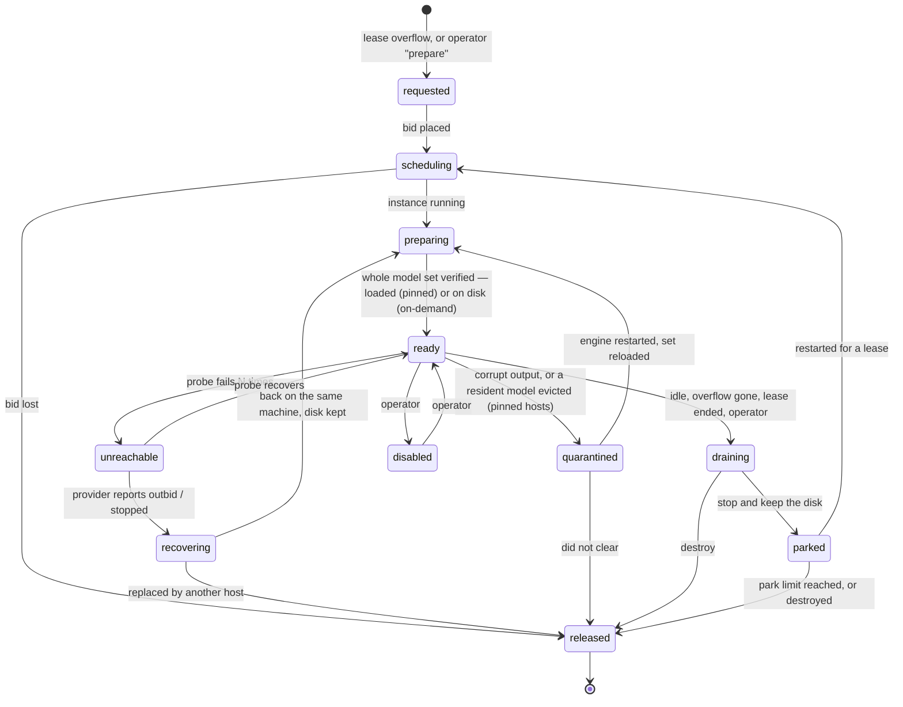

# Specification — Hosts, Capacity, Model Resolution and Routing

> Reasons for each rule are in [../decisions.md](../decisions.md) (D2, D4–D6, D9, D13, D22, D23).

## 1. Hosts

### 1.1 Host record

| Field | Meaning |
|---|---|
| `host_id` | Stable name within the pool |
| `kind` | `local` / `fixed-remote` / `rented-interruptible` / `rented-on-demand` |
| `provider_ref` | The provider's own identifiers, for rented hosts (instance, machine, offer) |
| `transport` | How it is reached: `tunnel`, `http` or `https` (§1.3), and the resulting URL and auth headers the router dials |
| `capabilities` | What the host can run — a set of labels such as `apple-silicon`, `cuda`, `fp8` — and how each was learned (§4.2) |
| `variants` | Per logical model: which build this host serves, its runtime class, whether it enforces structured-output schemas |
| `priority` | Routing tier; lower is used first. Defaults by kind: `local` 0, `fixed-remote` 10, `rented-interruptible` 20. Overridable per host |
| `workers` | The host's workers and their states (§2) |
| `state` | §1.4 |
| `cost` | Hourly rate, estimated spend, provider-reported spend, the lease it is charged to |
| `measured` | Rolling throughput, latency, failure and corrupt-output counts |

### 1.2 Kinds

| | `local` | `fixed-remote` | `rented-interruptible` |
|---|---|---|---|
| Exists because | it is configured | it is configured | a lease needed capacity, or an operator prepared it |
| Pool creates / destroys it | no | no (optional start / stop / restart commands) | yes |
| Pool configures its engine | no — verified, not set | no — verified, not set | yes, at creation |
| Can disappear without notice | rarely | rarely | yes — outbid at any time |
| Treated as always up for routing | yes, but still probed | no | no |

**Both rented kinds are supported** (D52), chosen by `rented.mode`: `interruptible` bids and
can be outbid; `on_demand` pays the listed price and cannot be; `cheaper` looks at both and lets
ranking decide. A fixed price is never bid down — above a ceiling it is refused, because
offering a marketplace less than it asks does not rent the machine — and a non-interruptible
host that stops was not outbid, so it is released rather than re-bid on.

**The mode is a default, not a fence** (D55). It governs what the pool rents by itself — overflow
under a lease, recovery after an eviction. An operator preparing a host may name a `kind`, or
one particular offer from the market view, whatever the mode; so one pool can hold on-demand
hosts and bid hosts together, and each reports which it is (`interruptible`). A chosen offer
goes through every filter, ceiling and cap any other offer does, and if it cannot be rented —
gone, outbid, or no longer passing — nothing is rented instead.

### 1.3 Transports

Transport is a property of the host, independent of its kind. The router only ever sees a URL
and optional headers.

| Transport | How the router reaches the engine | Auth | Typical use |
|---|---|---|---|
| `tunnel` | A supervised SSH local forward on an allocated local port, re-resolved from the provider on every reconnect | SSH key | Default for rented hosts; the engine is never exposed |
| `http` | Direct URL | Optional bearer / basic header | Private network or VPN |
| `https` | Direct URL, TLS verified by default; private CA file and client certificate supported | Bearer / basic header, or mutual TLS | An engine behind a reverse proxy |

- Inference engines generally have no authentication of their own. A plain-`http` host on a
  public address with no auth header is **refused at configuration load** unless that host sets
  `allow_insecure: true` — a visible, deliberate choice, never an accident.
- Secrets are referenced by environment variable or file path, never written in pool
  configuration, and never sent to a browser.
- Failures are classified identically across transports, so host states do not depend on which
  is used. For `tunnel`, "tunnel down" and "host gone" are told apart by asking the provider.
- For `tunnel`, a host's SSH key is recorded on first connection and checked on every later one,
  in a known-hosts file the pool owns; the address always comes from the provider's
  authenticated API, never from the host itself. The forward is the `ssh` client run and
  supervised as a child process, reconnecting with back-off on a local port that is fixed for
  the host's lifetime, and it binds loopback only. The back-off is forgiven only once a forward
  has held for 30 s (D60): one that comes up and dies at once would otherwise reconnect every
  second, and a provider answers that by throttling authentication.
- For rented hosts on `http` / `https`, the start-up script must put an authenticating proxy in
  front of the engine. `tunnel` needs none of that, which is why it is the default.

### 1.4 Host states



`local` and `fixed-remote` hosts move only among `ready`, `unreachable`, `quarantined`,
`draining` and `disabled`. Only `ready` hosts receive requests. `parked` means stopped by the
pool with disk and models kept: not routable, billing storage only.

## 2. Workers

A **worker** belongs to one host and serves one request at a time. It is a first-class object —
`<host>/w3` — with a state (`idle`, `busy`, `draining`, `disabled`), the request it is serving,
and its own counters.

- **Dispatch is a pull.** A request goes to an idle worker on the highest-priority eligible tier
  (§5). If none is idle it queues, and the next worker to free up takes the oldest request it is
  eligible for. Priority and queueing are one mechanism.
- **Resizing is graceful.** Reducing a host's worker count marks the surplus `draining`; they
  finish their current request and stop.
- **Every worker is visible** in the console with what it is doing.

*(A pool worker is serving capacity on a host. It is unrelated to any "worker" processes an app
may run for its own concurrency, and distinct from the engine's internal parallel slots, which
are the mechanism a worker maps onto.)*

### 2.1 How many workers a host has

The count is the smallest of three numbers — the hardware class's ceiling is an upper bound,
not a target:

```
workers(host) = min( capacity profile maximum   — what this hardware class can usefully run
                   , memory ceiling             — what fits, for the pool's model set and context
                   , operator override )        — an explicit lower number, if any
```

1. **Capacity profile** — a table matched on what the host reports (chip, or accelerator name
   and memory). First match wins; a host may name a profile outright. *Illustrative:* a
   laptop-class Apple-silicon machine → up to 3; an ~80 GB datacentre card → up to 6.
2. **Memory ceiling** — engines typically reserve worst-case context memory for every parallel
   slot and evict a model when the *predicted* total exceeds memory, regardless of actual use.
   The ceiling therefore depends on the model set and context length, not only the card:

   `ceiling = (usable memory − fixed overhead) / (memory per worker at the pool's context length)`

   operated at a fraction below the ceiling (default two-thirds), because beyond a knee extra
   concurrency adds latency without throughput. The constants are **calibration entries keyed by
   model set**, since they are only valid for the set they were measured on.
3. **No profile and no calibration → 1 worker**, flagged in the console. The pool does not guess
   upward.

**Built for hosts the pool rents (D45).** A profile matches on the *offer* — its hardware as the
market lists it, compared whole (so two of a card is not one of it), its memory, the rented
capabilities — and is decided **before the bid**, so the engine is launched with that
parallelism and the number is real. The number is then stored with the host and survives a
supervisor restart; editing the profiles later does not reach a host already running. It changes
only when an operator resizes that host (§2.3). With no match, a rented host runs `rented.workers`, marked as
the default wherever it is shown. The market preview shows what each offer would run.

Worker counts are recomputed when the pool's model set or context length changes — never per
request.

### 2.2 Keeping the engine in step

A worker is only real if the engine can run that many requests at once.

- **Hosts the pool creates**: engine parallelism and context length are set at creation to match,
  and stay in step afterwards — a resize relaunches the engine rather than changing the count
  alone (§2.3).
- **Hosts the pool does not create**: the pool cannot set engine parallelism and engines often do
  not report it. Left at a lower default, extra requests silently queue *inside the engine* and
  every latency figure lies. So **test connection** includes a concurrency check — *n* short
  generations at once, wall time compared with one; near *n*× means the engine is serialising —
  and tells the operator what to set.
- **Step down on evidence, never up.** If a resident model is seen evicted, or latency climbs
  with concurrency while throughput stays flat, the supervisor removes one worker and logs why.
  Raising a ceiling is an operator decision. *(Evidence-based step-down and calibration runs are
  post-v1; v1 uses profiles, the formula and overrides.)*

### 2.3 Resizing a host that is already running (D56)

An operator may change a rented host's worker count without replacing the host. The two
directions are not symmetric, because only one of them needs the engine to change:

- **Lowering** takes effect immediately. The surplus workers go `draining`, finish what they are
  serving and stop (§2). The engine keeps its larger parallelism; the pool simply stops using it.
  Nothing in flight is disturbed. This is also how an operator steers traffic away from a host
  that is serving badly without giving it up.
- **Raising** relaunches the engine, because parallelism is fixed when the engine starts. The
  host drains first, so no request in flight is failed; the engine is relaunched with the new
  numbers; the pinned model set is loaded again from the host's own disk — no download — and the
  host returns to `ready`. It is out of service for roughly a minute, reported as a stage like
  any other preparation.

What reaches the host is a closed set of bounded whole numbers — `workers`, `models_held`, and
optionally `context` — exactly as for a delegated host (D41). The relaunch is performed by the
start-up script the pool installed when it created the host; the pool never sends a command, a
path or a URL.

The new number is bounded by the memory ceiling of §2.1 and stored with the host, so an
adoption after a supervisor restart restores what the engine was actually started with. It is an
operator's act and never the supervisor's own pass: a relaunch stops a host serving, and
evidence-based resizing stays post-v1 (§2.2).

### 2.4 Automatic adjustment (D67, D68) — decided, not built

Opt-in: `rented.workers_auto`. A host **starts** at its capacity profile's number — **six where no
profile matches** — and finds its own from there, in both directions.

The engine is launched at the most the machine can really hold: the memory ceiling of §2.1, or
`workers_auto.max` (default 16) where that is lower. The pool uses that many workers or fewer, so
workers stay real — they never exceed what the engine runs — and every adjustment is a change of
router slots: instant, graceful, no restart.

A host steps **up** by one when it is saturated, requests are waiting, and its last step up raised
throughput by `min_gain`. It steps **down** by one when throughput stayed flat after its last step
up, when a resident model was evicted, or when its service time is far above the pool's median
for the same model. One change per host per window; never above the launch bound, never below
one. A profile's number is therefore a starting point and the evidence for it, not a cap; an
operator who wants a hard limit sets `workers_auto.max`. What a host settles on is kept in the
machine history, so that machine's next rental starts from evidence. This replaces §2.2's "never
up" for pools that enable it.

## 3. The pool's model set

A pool declares **the set of models it serves**, and every host must be able to serve **all of
them**. How a host holds them is its **residency** policy, set per host:

| `residency` | `ready` means | A model found evicted | For |
|---|---|---|---|
| `pinned` (default) | The full set is **loaded together**, in one engine process, kept indefinitely | Takes the host out of `ready`; it is re-prepared and the event logged | A machine dedicated to serving: nothing is swapped, no request can evict a model another needs, no host thrashes |
| `on_demand` | The full set is **on disk**; the engine loads a model on first use and may evict it when memory is wanted elsewhere | Nothing: the next request for it pays the load again | A machine also used for other work — a laptop — where keeping tens of gigabytes resident is not acceptable |

Hosts the pool creates are always `pinned`: it configures them, so it sets this at creation.
On the others the policy is verified by test-connection and every probe.

- The model set belongs to the pool, with its hosts, key and budget. **Leases do not name models.**
- **A host that cannot hold the full set does not join the pool**, whatever its kind — not
  loaded on a pinned host, not on disk on an on-demand one. The console says which host fails
  and by how much. The set, the context length and the smallest host have to agree.
- **A request for a model outside the set is refused** (`404 model_not_in_pool`), never loaded.
  Adding a model is a configuration change applied by re-preparing hosts.
- **Nothing is ever downloaded because a request asked**, on either policy. A tag that is not
  on disk keeps the host out of routing until the operator pulls it. A load into memory on an
  on-demand host is the engine's own behaviour, for a tag the operator listed and put there;
  the request that finds a model cold pays its load time, and `X-GPM-Wait-S` does not include
  it — that is generation from the pool's point of view.

## 4. Model resolution

### 4.1 Logical names and the catalog

An app asks for a model by its **logical name**; the pool serves the build that suits the host.
**Only names listed in the catalog are ever resolved.** Anything else is passed through exactly
as requested: no substitution, no guessed names, no pull. (A convention that downloads
artifacts by a guessed name is a supply-chain risk, a silent substitution nobody wrote down,
and an unrequested multi-gigabyte download.)

A catalog entry lists variants in preference order. Each variant states the **host capabilities
it requires**, its runtime class, and whether it enforces structured-output schemas:

```yaml
models:
  my-model:7b:
    variants:                                   # first variant whose requirements the host meets wins
      - tag: my-model:7b-mlx
        requires: [apple-silicon]
        runtime_class: apple-mlx
        enforces_schema: false                  # true / false / omitted, see below
      - tag: my-model:7b-fp8
        requires: [cuda, fp8]
        runtime_class: cuda-fp8
      - tag: my-model:7b                        # no requirements: the fallback everywhere
        runtime_class: by-platform              # e.g. apple-gguf on Apple silicon, cuda-gguf on CUDA
  my-embedder:
    variants:
      - tag: my-embedder
```

"Apple-optimised build on a Mac, standard build elsewhere" is one instance of this. The same
mechanism covers quantisation formats, reduced-precision builds for cards that support them,
and anything else where the right artifact depends on the machine.

**Per request:** the router picks a host (§5), looks up the variant recorded for that
(host, logical model), rewrites the request's model field, and forwards. The response body is
left untouched — it names the tag that really ran — and the router adds `X-GPM-Served-Model`.

- **An explicit variant tag is taken literally** and is eligible only where that tag is resident.
  A client may also switch resolution off for a call.
- **A request carrying a structured-output schema never resolves to a variant declared not to
  enforce one.** Some engine back-ends accept a schema and ignore it; silently routing a
  schema-constrained call there turns guaranteed-valid output into best-effort output.
  `enforces_schema` is **three-valued** — `true`, `false`, and unstated. For a
  schema-carrying request the router uses the host's first `true` variant **if it is
  resident**, then any unstated one; a `false` variant is never used, and a host with nothing
  usable is ineligible, so the request moves down the priority order. A model with no catalog
  entry has no declaration and is passed through as it would be to a bare engine.
  Holding both builds costs memory; where they do not both fit, that host simply does not take
  schema-constrained requests.

### 4.2 Learning a host's capabilities

Capabilities are settled by the cheapest available evidence, in order, and the source recorded:

| # | Evidence | Applies to | In v1 |
|---|---|---|---|
| 1 | Declared in configuration | any host | yes |
| 2 | Implied by how the pool created it (the provider offer's hardware, the image used) | rented hosts | yes |
| 3 | Inspected over an existing SSH connection, or locally | `tunnel` hosts, `local` | yes |
| 4 | **Behavioural probe** — try the preferred variant with a short generation and a schema-constrained call; on success record the capability, on failure record its absence and never retry. Re-examined only when the engine version or host identity changes, or on operator request | hosts reachable only over `http` / `https` and still unknown | **post-v1** |

Hosts the pool rents are **never probed by download**: pulling a multi-gigabyte variant onto a
host that bills per gigabyte, to learn something the offer already stated, is pure cost. An
unknown capability never blocks a request — the host serves its no-requirements variant.

A (host, model) pair whose preferred variant later fails or corrupts is demoted to the next
variant for that pair only, with an event logged.

### 4.3 Runtime class

Different builds of the "same" model are not output-equivalent, and the same build behaves
differently across back-ends. Every (host, served variant) pair therefore has a **runtime
class**, derived from the variant and the host's platform, never typed in by hand.

- A request may **pin** the classes it accepts (`X-GPM-Runtime-Class`). Pinning is eligibility,
  applied before priority. It states a requirement on the output, not on where the GPU is.
- **Unpinned is the default**, and with local-first routing an unpinned workload is served by
  several classes — including, because each call is routed independently, **within one
  multi-call session**. This is accepted, and handled by recording rather than preventing:

  1. The pool records *(model requested, model served, runtime class, host)* for every call. The
     model name alone is not enough: a model with a single build runs under the same tag on
     different platforms.
  2. The record must be joinable onto whatever the adopter analyses — by session id and
     timestamp from the pool's request log at minimum.
  3. The adopter's first real run includes a **per-class comparison** of whatever behaviour
     matters to them. Random per-call assignment makes this a sound equivalence test.
  4. If classes differ materially, switch on `session_build_consistency`: the class that served
     a session's first call becomes an eligibility filter for the rest of that session. This is
     not host affinity — any host of the same class may serve any call, so priority and failover
     keep working.

  Recording detects mixing; it cannot repair a mixed dataset. The remedy is to switch the option
  on and regenerate. *(The switch is post-v1; pinning is in v1.)*

## 5. Routing

Strict tiers. A lower tier is touched only when every eligible worker above it is busy.

| Tier | Kind | Why |
|---|---|---|
| 0 — first | `local` | Free, and treated as always up (still probed; an unreachable local engine is skipped, not fed) |
| 10 | `fixed-remote` | Steady capacity that exists whether or not it is used |
| 20 — last | `rented-interruptible`, `rented-on-demand` | Brought up and down on demand, and may vanish mid-run |

Per request:

1. **Eligible hosts** = state `ready` (the whole model set loaded on a pinned host, on disk on
   an on-demand one); a usable variant of the requested model for this request (§4.1, including
   the schema rule) — one that is loaded, or on disk where the host is on-demand; runtime class
   acceptable if the request pinned one. Priority only orders eligible hosts.
2. Take the **highest-priority tier with an idle worker**.
3. Within that tier, the host with the lowest `busy / total` workers; ties broken by measured
   throughput. **Session affinity is off by default**; `within_tier` and `across_tiers` exist as
   options (post-v1).
4. All eligible workers busy → queue, **first come, first served**, bounded by the queue
   timeout. No request classes and no separate lane for short calls: an embedding request waits
   its turn like any other. No eligible `ready` host at all → `503` with a reason.
5. If the chosen host fails before the first response byte, retry **once** on the next eligible
   host in the same order. A failure mid-stream is surfaced unchanged.

Two consequences of routing to rented hosts last:

- **Rented hosts go idle first**, so idle release lands on exactly the hosts that cost money.
- **What to rent is the overflow** — demand the higher tiers cannot absorb — and rented hosts
  are released in reverse priority order.

One cost to know: strict priority keeps the slowest local engine permanently busy. It adds
throughput but makes per-request latency uneven. The serving host is recorded per call, so the
effect is visible.

## 6. Request log

Every request is recorded: time, session id if sent, host, worker, model requested, model
served, runtime class, queue wait, latency, token counts, outcome. It is the source for the
console, for idle detection, for corrupt-output counters, and for the offline join described in
§4.3. It contains **no prompt or completion text**.
